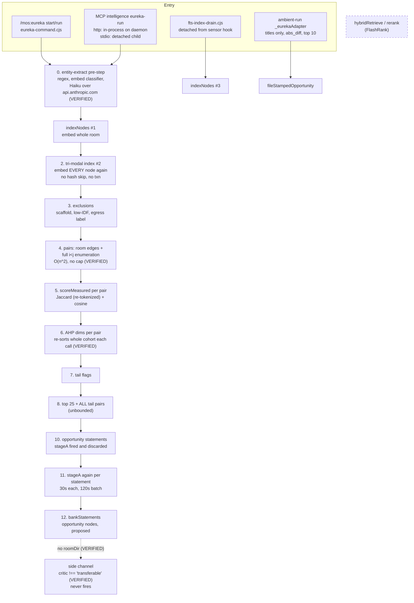

# Eureka engine: architecture review

## 0. Bottom line

1. **Eureka's cost comes mostly from its own algorithm, not from the model.** Pair generation is an
   unbounded all-pairs loop. The per-pair scoring re-sorts the whole cohort every time. The whole
   room is embedded two or three times per run, with no incremental skip. Capping ONNX threads
   (SEED-099 F3) is necessary but treats the symptom.
2. **SEED-100's premise is partly wrong.** It names "local FlashRank rerank" as the stage to
   replace. The reranker is **not in the production pipeline**: `hybridRetrieve` and `rerank`
   have no production caller. The stage that actually decides quality is the **AHP composite
   plus the Stage A critic**. Stage A calls no LLM, and its novelty gate is always skipped in the
   portfolio run.
3. **Eureka is not "ZERO network" today.** The entity pre-step escalates to `claude-haiku-4-5`
   over `api.anthropic.com` with room excerpts, **even under `--offline`**. The Part 8 objection
   SEED-100 raises against Claude judging has in effect already been conceded without a ruling.
   That argues for making the egress explicit and governed, not for keeping it hypothetical.
4. **Two correctness bugs keep a whole feature dark** (the side channel), and the documentation
   says the runner writes nothing when it writes nodes.

## 1. Requirements (what Eureka is for, inferred from code and canon)

| Kind | Requirement |
|---|---|
| Functional | From one room's graph, surface a small ranked set of cross-domain pairs whose mechanisms transfer, as Opportunity Statements, banked as `proposed` opportunity nodes with provenance |
| Functional | On demand (`/mos:eureka`, MCP `eureka-run`) and ambient (Phase 355.1) |
| NFR, laptop | Bounded CPU, RSS and wall time; background work must not degrade the foreground; battery aware (SEED-099) |
| NFR, quality | Findings are calibrated against a gold set; no fabricated quantities; verdicts never claimed without a check (the GAP-1 lesson) |
| NFR, governance | Part 8: declared egress only. Part 9: writes through the chokepoints. Proposed-only |
| NFR, operability | One run per room at a time; resumable status; no silent dead paths |

## 2. The pipeline as it is (VERIFIED where marked)

Models: embeddings use `MongoDB/mdbr-leaf-ir`, q8, 384 dims (`embedding-spine.cjs:112-113`). They
load lazily and are cached per process, so the model reloads on every CLI child run. **No thread
setting anywhere.** The rerank models (`ms-marco-TinyBERT-L-2-v2` / `MiniLM-L-6-v2`) exist only
on the dead `rerank` path. The LLM in the pipeline is `claude-haiku-4-5` in the pre-step
(`entity-classifier.cjs:60-64`).

## 3. Findings

### Algorithmic (root cause of the laptop load)

| # | Finding | Evidence | Effect |
|---|---|---|---|
| A1 | All-pairs enumeration with no cap; `--top` trims only the output | `eureka-portfolio-report.cjs:1178-1183` (VERIFIED); `PROGRESS_EVERY = 100000` exists | CPU and memory grow quadratically with room size |
| A2 | `scoreTechDimensions` maps and sorts the whole cohort on every call, twice per pair | `portfolio-dimensions.cjs:155-170` (VERIFIED) | about O(n² · n log n) overall. The sorted arrays are identical every call and could be computed once. |
| A3 | Whole-room re-embedding 2-3x per run (entity-extract `indexNodes`, then the runner, and separately the FTS drain) | `entity-extract.cjs:1168`, `tri-modal-index.cjs:401`, `fts-index-drain.cjs:172` | ONNX runs on every core, with no thread cap, at least twice per run |
| A4 | Vector writes: DELETE+INSERT per node, statements re-prepared per row, no transaction | `vector-store.cjs` | slow and I/O-heavy, and it leaves a partial index on a crash |
| A5 | Jaccard re-tokenizes both texts for every pair | `rs-differential-scorer.cjs:509` | avoidable n² tokenization |
| A6 | Statement set = top 25 **plus every tail pair** | selection at `:1340` | the critic's work is bounded only by the 120s batch deadline |
| A7 | On the MCP http path the whole run happens in the daemon's process | `tool-router.cjs:1499` | a large room blocks the event loop for every other MCP tool |

### Correctness

| # | Finding | Evidence |
|---|---|---|
| C1 | The side-channel pick compares `item.critic !== 'transferable'`, but a resolved `statement.critic` is the Stage A **object** (`{pass, route, tag, features}`), which is mapped to `null` at `:2104`. Stage A never returns a `verdict` field. **No pick can ever qualify.** | `eureka-portfolio-report.cjs:2104,2127`; `opportunity-statement.cjs:433`; `eureka-critic.cjs:245-322` (VERIFIED) |
| C2 | `bankStatements(db, BANK_SESSION_ID, statements)` is called with no opts, so no `roomDir`, and `writeStampedSideChannel` fails with `room_dir_missing` | `:1447` (VERIFIED) |
| C3 | Stage A runs twice per statement: once fire-and-forget in the sync gate, then again in the resolution pass | `opportunity-statement.cjs:305` (VERIFIED), `:416` |
| C4 | Gate 3 (novelty delta) is always skipped in the portfolio run, because `knnFn` is not supplied | `eureka-critic.cjs` Gate 3 |
| C5 | `--offline` does not stop the Haiku pre-step or `--stamp` (Theo). The "ZERO network" headers are inaccurate. | `entity-classifier.cjs:60-64` (VERIFIED), `eureka-command.cjs:222` |
| C6 | `commands/eureka.md` and the `eureka-command.cjs` header say "report-only, ZERO writes to nodes", but the runner banks opportunity nodes | header :26-29 |
| C7 | `start` does not forward `--no-extract` to the detached child | `eureka-command.cjs:457` |

### Structure and operability

| # | Finding |
|---|---|
| S1 | No cross-process lock. The CLI `start` and an MCP run can collide on one room. `_eurekaScanInFlight` is in-memory and set only on the http path. `status.json` is written without an atomic write, and the ledger read-modify-write is not locked. |
| S2 | The ambient adapter is a second scorer: titles only, no vectors, ranked by `abs_diff` instead of AHP. Ambient and on-demand therefore rank differently by construction. |
| S3 | Dead or unwired code: `hybridRetrieve`/`rerank`, `runEurekaScan` (its header says it "never completes in production"), and `compression-meter`, `eureka-offer`, `lateral-engine-adapter`. |
| S4 | `lib/core/eureka/` (32 files) mixes in unrelated features (grade-grant, qualify-opportunity, explore-chain, opportunity-harvest). About half the directory is not Eureka. ICM invariant 1: one folder, one job. |
| S5 | `opportunity-harvest.cjs` requires `room-db.cjs` directly, bypassing the navigation door. |
| S6 | The dedupe `Map` in the `eureka_critic` MCP tool never evicts, so it grows without limit in a long-lived daemon. |

## 4. Review of SEED-099 (resource guards)

**Keep. Its priority is right, but it treats symptoms. Add the algorithmic fixes as the first items.**
- F1 (priority), F2 (heap), F3 (ONNX threads), F4 (battery) and F5 (global lock) all stand. F5
  becomes more important given S1: there is already no per-room lock across CLI and MCP.
- **Missing, and should come before F1-F5:** A1 (a hard pair cap: pre-filter candidates per
  node through top-k vector neighbours instead of all i<j), A2 (compute the cohort percentiles
  once), A3 (embed once per run and skip unchanged nodes by content hash), A4 (one transaction
  per index run), A6 (a bounded tail quota), A7 (never run in-process on the daemon; always a
  child).
- **Correct the A4 hypothesis in the seed.** The 360% CPU is ONNX embedding without a thread
  cap. The likely trigger inside an `--offline` test is the **entity pre-step, which `--offline`
  does not disable** (C5): it embeds the fixture room with the real model from the warm cache.
  This is not the reranker, which never runs. It stays a hypothesis until profiled.
- F7 (test-216 hygiene) should add: run the tests with `--no-extract` or a stubbed pre-step.

## 5. Review of SEED-100 (Claude / Jev judge spike)

**The question is still worth asking, but the spike is aimed at the wrong stage and should be re-framed.**
- **Arm A describes a stage that does not run.** Replace "local FlashRank rerank + existing
  scoring" with what actually runs: `scoreMeasured` (lexical/semantic differential) + the AHP
  composite + tail flags + the Stage A critic.
- **The judge slot already exists.** Stage B (`runRubric`, the two-pass neutral/adversarial
  rubric through an injected `judgeFn`) is the pair-judgment seam. It runs in reasoning mode
  with the host Claude as judge, and the live portfolio run never reaches it. B1/B2/B3 are
  therefore not new stages. They are **different `judgeFn` implementations plugged into Stage B
  and turned on for the live run**. That is a much smaller change and keeps orthogonality: the
  judge is swappable and the output stays the same.
- **The Part 8 framing needs updating.** Eureka already sends room excerpts to Anthropic (C5). The
  spike's Part 8 question should become "make all Eureka egress explicit, declared and governed
  under one ruling", covering the Haiku pre-step, the judge, and Jev.
- **Add a candidate-generation question.** The cheapest large quality and cost win may be better
  candidates: top-k vector neighbours per node plus graph edges. A better judge on 25 pairs chosen
  from an unbounded all-pairs list is still limited by that list.

## 6. Decisions (ADRs, proposed)

### ADR-E1: Bound candidate generation
**Status:** Proposed
**Context:** i<j enumeration is O(n²) with no cap (A1); scoring is super-quadratic (A2).
**Decision:** Candidates = the room's own edges ∪ the top-k cosine neighbours per node, from the
vector index, restricted to cross-root/cross-type pairs, with a hard global cap and a
`pairs_truncated` count in the report. Compute cohort percentiles once per run.
**Alternatives:** keep all-pairs with a time budget (unpredictable output, still quadratic
memory); random sampling (not reproducible, and misses the strongest pairs).
**Consequences:** + near-linear cost, predictable RSS. − could miss a pair whose members are not
vector neighbours; the navigator's gold set measures this (SEED-100).

### ADR-E2: One index, built incrementally
**Status:** Proposed
**Context:** two or three full re-embeds per run, no transaction (A3, A4).
**Decision:** One `indexNodes` owner, keyed by a content hash in `eureka_meta`. It embeds only new
or changed nodes, in one transaction per run. entity-extract and the FTS drain call the same
function and never re-embed unchanged rows.
**Alternatives:** a cache in memory only (lost on every CLI child); leave it (the dominant cost).
**Consequences:** + far fewer ONNX runs. − hash-invalidation logic to maintain.

### ADR-E3: Heavy work runs only in a bounded child, never in-process
**Status:** Proposed
**Context:** the http daemon runs Eureka in-process (A7); children have no limits (SEED-099).
**Decision:** Every entry point (CLI, MCP http and stdio, ambient) goes through one spawner that
applies nice, a heap cap and a thread cap, a wall-clock watchdog, and a machine-global lock plus
a per-room lock, with an atomic `status.json`.
**Alternatives:** worker_threads in the daemon (shares memory with the daemon, so a crash kills it).
**Consequences:** + isolation and one place to govern. − the model reloads per child; ADR-E2 limits the cost.

### ADR-E4: Judgment is a pluggable Stage B `judgeFn`, and all egress sits under one declared policy
**Status:** Proposed, pending the SEED-100 spike and a Part 8 ruling
**Context:** Stage B exists but is off in the live run. Egress already happens (Haiku) without a ruling (C5).
**Decision:** Turn Stage B on for the top-N survivors, with `judgeFn` ∈ {none, host-Claude
subagent, Jev (behind a runtime client), Claude-then-Jev}. Declare every Eureka egress (entity
escalation, judge, Theo stamp) in one policy, with `--offline` meaning none of them.
**Alternatives:** keep a local-only judge (Stage A cannot assess mechanism transfer).
**Consequences:** + quality where it matters, a swappable judge, honest egress. − cost per run and a network dependency, both measured in the spike.

### ADR-E5: One scorer for ambient and on-demand
**Status:** Proposed
**Context:** ambient scores titles-only by `abs_diff`, while on-demand uses vectors and AHP (S2).
**Decision:** Ambient calls the same library path with a smaller budget.
**Consequences:** the same pair ranks the same way everywhere; one of the two scorers is deleted.

## 7. Immediate fixes that need no decision

1. C1 + C2: compare `item.critic?.pass === true` (or map the Stage A object to a verdict string once, at resolution), and pass `{ roomDir }` into `bankStatements`. Add a test that the side channel fires on a stamped transferable pick.
2. C3: remove the fire-and-forget Stage A call from the sync gate.
3. C5/C6: make `--offline` disable the Haiku escalation and `--stamp`, and correct the "ZERO writes" and "ZERO network" headers and `commands/eureka.md`.
4. C7: forward `--no-extract`.
5. S6: bound the dedupe `Map` (LRU).
6. S3/S4: remove only the ghost functions `hybridRetrieve()`/`rerank()` (or record why they are kept). **Do not delete `hybrid-retrieve.cjs`**: `rrfFuse` is live via `f-selector-ranker` (corrected in section 10.1). Moving the non-Eureka modules out of `lib/core/eureka/` is ADR-E7, gated by reference integrity, not a quick fix.

## 8. Risks

| Risk | Mitigation |
|---|---|
| ADR-E1 cap drops good pairs | gold-set recall measured in SEED-100; `pairs_truncated` reported |
| Turning Stage B on raises cost and latency | top-N only, on demand only, never in the ambient run; measured per run |
| Fixing C1/C2 lets a dormant feature start filing | ships behind the existing proposed-only gate; a counter-metric watcher per Phase 343 |
| Deleting dead code removes planned work | check SEED/phase references before deleting; move the module to `lab/` rather than removing it |

## 9. What this review did not verify

- The runtime profile. Every performance claim is static reasoning from the code, not
  measurement; the SEED-099 profiling task still stands.
- Items marked without VERIFIED come from the subagent's map and were not re-read by hand. They
  include: A3's FTS drain path, A4, A5, A7's http in-process detail, S1-S6, C4 and C7.

---

## 10. ICM re-review (icm-architect, system-map form), 2026-10-01

Lens: the `icm-architect` skill (ten invariants, `references/core.md`, `references/system-map.md`, `references/reference-integrity.md`), applied to Eureka as a **system map**: a body of code later agents will change. The question it asks is "what is X, and what else moves if I change X".

### 10.1 The headline: product name and folder name mean different things

`lib/core/eureka/` is **not Eureka**. About 40 files outside the folder import from it (VERIFIED by grep). The heaviest users are not the portfolio pipeline:

| Module in `eureka/` | Imported by (outside the folder) |
|---|---|
| `embedding-spine` | `hsi-engine.cjs`, `rs-engine.cjs` (other ambient producers) |
| `tri-modal-index` | `lazygraph-ops.cjs`, `sensors/sensor-content-relevance.cjs` |
| `fts-index-lifecycle` | `navigation-engine.cjs`, `sensor-content-relevance.cjs` |
| `eureka-reach-runner` | `navigation-engine.cjs`, `mcp/stop-gate-handler.cjs` |
| `scaffold-template-index` | `navigation/room-birth.cjs` |
| `research-filing` | `url-ingest.cjs`, research-planner |
| `hybrid-retrieve` (`rrfFuse`) | `workflow/f-selector-ranker.cjs` |

In system-map terms, the one-line catalog entry reads: **"Eureka" (the product: `/mos:eureka`, the ranked cross-domain portfolio) = `scripts/eureka-portfolio-report.cjs` + `scripts/eureka-command.cjs` + a subset of `lib/core/eureka/`. `lib/core/eureka/` (the folder) = the plugin's shared semantic-index substrate (embeddings, vectors, FTS), plus the Eureka pipeline stages, plus unrelated features.** Invariant 1 (one folder, one job, stated inside itself) fails on both counts: the folder has three jobs and no `CONTEXT.md` saying so. `lib/core/navigation/` and `lib/core/research-planner/` already carry a `CONTEXT.md`, so the precedent exists.

**Consequence for the seeds, which the first review missed:** the change-impact of SEED-099 and ADR-E2/E3 is wider than Eureka.
- A thread cap in `embedding-spine` (SEED-099 F3) also changes `hsi-engine` and `rs-engine`. That is the right single place to apply it, but their timings move too.
- Making `tri-modal-index` incremental (ADR-E2) changes what `lazygraph-ops` and `sensor-content-relevance` see.
- **Correction to section 7, item 6:** `hybrid-retrieve.cjs` is not dead. `rrfFuse` is live through `f-selector-ranker`, and `sensor-content-relevance` borrows its floor idiom. Only `hybridRetrieve()` and `rerank()` inside it are ghosts. Deleting the file breaks a live caller. This is exactly the reference-integrity failure the skill's gate exists to catch.

### 10.2 Universes (live / leftover / ghost)

| Universe | Members |
|---|---|
| **live** | the portfolio runner stages (§2), `embedding-spine`, `vector-store`, `tri-modal-index`, `fts-index-lifecycle`, `opportunity-statement`, `eureka-critic` Stage A, `ahp-weights`, `portfolio-dimensions`, `tail-quadrant`, `candidate-exclusion`, `room-native-substrate`, `eureka-reach-runner` (the side-channel and ledger half), `rrfFuse` |
| **leftover** | `scripts/eureka-room-report.cjs` (the older runner, still the source of `stubEncode` and the vector loader); the ambient title-only scorer (S2) |
| **ghost** | `hybridRetrieve()` / `rerank()` (FlashRank); `runEurekaScan` (its header says it never completes in production); `compression-meter`, `eureka-offer`, `lateral-engine-adapter`; Stage B in the live run (wired, never reached); the side channel (C1/C2: wired, never fires); the "ZERO writes" and "ZERO network" doc claims |

The system-map rule is "do not implement against ghosts". **SEED-100 as first planted did exactly that**: its arm A was the FlashRank rerank. The re-aim in `cc262533a` fixed it. The general lesson: **a seed that names a stage should cite the live caller of that stage**, or say which universe it is in.

### 10.3 The ten invariants against the engine

| # | Invariant | Eureka today | Verdict |
|---|---|---|---|
| 1 | One folder, one job, stated inside | three jobs in one folder, no `CONTEXT.md` | fails |
| 1 / principle 1 | One stage, one job | `eureka-portfolio-report.cjs` is one 2570-line module running 13 stages (§2) | fails |
| 4 | Explicit per-folder contract | none for `eureka/`; `commands/eureka.md` contradicts the code (C6) | fails |
| 6 | Every output is an edit surface | only the final report is a file. Candidates, scores, statements and critic verdicts live in memory, so no human or test can inspect a stage | fails |
| 7 | Load only what the step needs | the whole room is re-embedded 2-3 times per run (A3): the compute version of photocopying the library into a backpack | fails |
| 8 | One home per fact | two scorers (S2), three index writers (A3), the ledger path duplicated in `sensor-eureka.cjs:113`, docs contradicting code | fails |
| 9 | The filesystem is the state machine; generated indexes rebuilt by script | `eureka_meta` has no content hash; `status.json` is non-atomic; the ledger has no lock (S1) | partial |
| 5 | Factory vs product | `data/portfolio-ahp-matrix.json` and the models are factory; the reports are product. The split holds | holds |
| 10 | Instantiate by copying | n/a (code, not a workspace) | n/a |

### 10.4 What ICM adds to the ADRs

- **ADR-E6 (new): make the pipeline stages edit surfaces.** Split the runner along its real
  stage boundaries, each writing one plain file under `.mindrian/eureka/run-<ts>/`:
  `01_candidates.jsonl`, then `02_scored.jsonl`, then `03_statements.md`, then
  `04_verdicts.jsonl`, then the banked nodes. Each stage reads only the previous stage's
  output. **This is also what makes SEED-100 fair and cheap.** Every judge arm reads the same
  `01_candidates.jsonl` and writes its own `04_verdicts.jsonl`, and the gold-set comparison
  becomes a file diff. It also turns ADR-E1's recall question into something that can be
  checked by opening a file.
  - *Where ICM loses:* the ambient run is automated, with no human between stages. ICM names
    automated mid-pipeline branching as a place it loses. So the ambient run writes the same
    files but does not gate on them; the human check sits only before banking, where it
    already is (proposed-only).
- **ADR-E7 (new): split the folder by job, behind a reference-integrity gate.** Target:
  `lib/core/semantic-index/` (spine, vector-store, tri-modal, fts-lifecycle, rrfFuse),
  `lib/core/eureka/` (the portfolio stages only), and the unrelated features moved out to
  their own homes. Each folder gets a `CONTEXT.md`. Process, per `reference-integrity.md`:
  enumerate every referrer (the ~40 above, plus tests, plus `commands/*.md` path mentions,
  plus doctor modules); move with copy, verify, then remove; update every referrer in the
  same change; check case-folded destination collisions on Windows. **This is not a
  quick fix.** It is the largest item here and needs its own phase.
- **A system map for the engine, proposed only (slice 0).** A `map/` shelf for Eureka +
  semantic-index: objects (Pair, Candidate, Statement, Verdict, OpportunityNode, EurekaVec,
  RunStatus), processes (index, generate, score, judge, bank, ambient-stamp), and an
  `effects/CONTEXT.md` that walks **inward** from the ~40 outside referrers. Per the skill,
  this is written only after approval of the tree, one slice at a time.

### 10.5 What the seeds should carry (proposed; not yet applied)

- SEED-099: a **change-impact line**. Items F3 and A3 touch `embedding-spine` and
  `tri-modal-index`, which `hsi-engine`, `rs-engine`, `lazygraph-ops` and
  `sensor-content-relevance` also use; re-run their tests.
- SEED-100: **cite live callers**. Each arm names the live function it replaces or plugs into
  (Stage B `runRubric`/`judgeFn`, `eureka-critic.cjs:472`). Adopt ADR-E6 as the spike harness.
- New seed candidate: ADR-E7 (the folder split plus `CONTEXT.md`s), gated by reference integrity.
