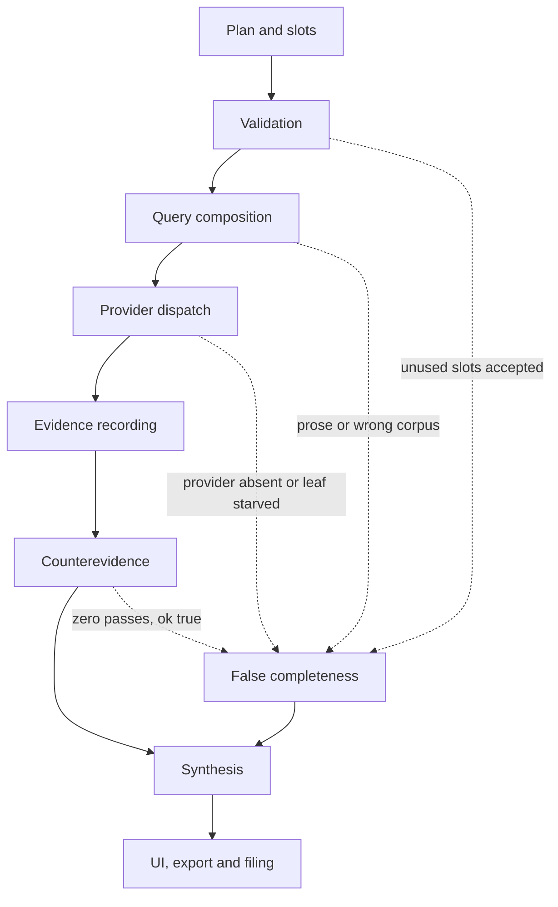

# 369.2 engineering brief: MindrianOS Code and AI Behavior Inspector

Filed verbatim by the orchestrator on 2026-10-05 from the navigator's paste. It is the cumulative diagnosis over five evidence sets and the authoritative engineering brief for Phase 369.2 (and the phases it spawns). Only two edits were made: this header, and the en-dashes inside time ranges (for example 49:12-49:18) were normalised to hyphens for the repository's dash guard. One reconciliation the planner must carry: CODE-05 and OK-03 in the register say "refuse prose"; the navigator's 2026-10-04 ruling (SEED-115, quick 261004-v16) says a room phrase or question may fill a web-search slot. These agree once read precisely: never send a sentence as an exact-phrase (quoted) query that guarantees zero; shape it into a query (HARNESS-09's four families) and send that, shown on the grant card; refuse only when no shaped query can be formed. The strict rule stays on the Theo lines. Where this brief and the register (369.2-ISSUE-REGISTER.md) overlap, the IDs map as: CODE-01 = SW-02 + SW-20, CODE-02 = SW-04, CODE-03 = SW-05, CODE-04 = SW-06, CODE-05 = SW-07, CODE-06 = SW-08, CODE-07 = SW-10, CODE-08 = SW-09, CODE-09 = SW-12, CODE-10 = SW-18 + SW-17, HARNESS-01 = SW-03, HARNESS-03 = SW-11, HARNESS-04 = SW-19, UI-02 = SEED-120 BUG-01, UI-05 = SEED-120 BUG-02.

---

Engineering brief for Claude Code

This is a cumulative diagnosis of five unique evidence sets:

1. A live 2:23:11 product session between Lawrence Aronhime and Yehonathan Sagir.
2. The beta.57 field report Twelve Silent Degradations, based on two Scientific Roadmapping deep runs.
3. The beta.43 room-switch report that isolates a Python 3.9 compatibility failure.
4. The autonomous NDC run transcript, including agent launches, Stop-hook behavior, quota exhaustion, transcript export and later correction after outside reading.
5. The session review Zero Confirmed Claims and the derived NDC briefing Interrogating FPV Countermeasures.

The ZIP copy of Twelve Silent Degradations duplicates the attached defect report and is treated as corroborating packaging, not an independent observation. The room-switch attachment is likewise the complete source for the already-listed beta.43 defect.

The job is to determine which failures belong to deterministic code, which belong to the agent harness, and which are AI-output behavior. Verify every historical line reference against the current tree before editing. Preserve the controls that worked.

## Invocation for Claude Code

Use this document as the engineering task brief. Begin with a read-only audit of the current repository and produce the requested status table for every failure ID. Reproduce current failures before patching them. Then implement the phases in order, starting with execution truth and research integrity. Keep changes reviewable, add regression coverage at the owning layer, and report any finding that contradicts this brief. Do not treat a prompt change as a fix for missing execution state, broken tool behavior or unavailable evidence.

## The central diagnosis

The most dangerous failures occur when the harness does not execute the intended research step but still gives the model a normal-looking state. The model then produces a fluent conclusion from incomplete evidence. The visible "AI behavior" is downstream of an execution-truth failure.

The system needs one invariant:

Every promised research operation must be proven executed, explicitly refused, or explicitly marked not executed. A missing operation may never be represented as an empty research result.



## Ownership boundary

| Layer | It owns | It does not own |
|---|---|---|
| Deterministic code | Compatibility, source mappings, slot consumption, state transitions, graph writes, CLI contracts | Explaining an unknown state that code never exposes |
| Agent harness | Planning, dispatch completeness, provider reachability, budgets, retries, execution ledger, synthesis gates, checkpoints | Inventing evidence for an unexecuted operation |
| AI behavior | Clear language, definitions, referents, explanation of choices, report structure, calibrated uncertainty | Repairing a dead provider, changing rooms, or proving a tool call ran |
| UI and observability | Active room/session/task, approvals, progress, errors, filenames, recovery state | Deciding research validity without harness evidence |

## Source and evidence hierarchy

| Source | Evidentiary use | Limits |
|---|---|---|
| Live call transcript | User-visible behavior, timestamps and workarounds | No code or telemetry attached |
| Autonomous-run transcript | Exact orchestration sequence, agent failures, quota errors and generated claims | Includes model narration, which is evidence of model behavior rather than proof that its factual assertions are true |
| Twelve Silent Degradations | Code-localized defects and run outputs | Historical beta.57 report; current tree still requires reproduction |
| Zero Confirmed Claims | Claim-state audit and post-session self-review | Derived review, not an independent run |
| NDC briefing | Publication behavior, evidence labeling and the report's stated limitations | Working paper; factual claims remain subject to the review's source caveats |
| Room-switch report | Reproduction, traceback and exact beta.43 compatibility cause | Current release status unknown |

## Failure register

### A. Deterministic code failures

**CODE-01: room switching fails on Python 3.9**
- Evidence status: root cause proven for beta.43; current-release status unknown.
- Symptom: the write-scope guard blocks writes to a non-active room, then /mos:rooms switch cannot change the room.
- Root cause: inline Python calls datetime.datetime.now(datetime.UTC). datetime.UTC requires Python 3.11, while stock macOS resolves python3 to 3.9.6 in the reported environment.
- Reported sites: scripts/room-registry:296, scripts/room-registry:515, scripts/resolve-room:157, scripts/on-cwd-changed:97.
- Required change: use datetime.timezone.utc at every current occurrence. Keep the post-write verification. Return child stderr through lib/core/room-open.cjs instead of reducing the failure to set_active_failed.
- Regression test: run set-active/get-active under Python 3.9 and every supported newer version. Confirm the ownership stamps remain coherent.

**CODE-02: patent intent maps to PubMed**
- Evidence status: code-localized in beta.57 field report.
- Location: lib/lens-engine/source-lens-driver.cjs, LENS_TO_SOURCE.
- Root cause: patent: 'pubmed' substitutes a biomedical corpus for a patent corpus while --broad presents the lane as patent coverage.
- Consequence: a missing capability appears to be a valid patent search with zero relevant results.
- Required change: integrate a real patent source or reject the patent lens with provider_unavailable:patent. Rename only if the product truly intends a biomedical proxy.
- Regression test: a known patent identifier returns patent provenance. An install without a patent provider refuses before dispatch.

**CODE-03: lane grouping starves later leaves**
- Evidence status: mechanism and affected runs identified.
- Location: lib/core/research-planner/deep.cjs, non-SR laneSpecs to roundOneQueries.
- Root cause: leaves are grouped by lens, but the fixed round-one budget is filled from the first leaf with slots. Later leaves on the same lens receive no fetch.
- Consequence: planned dimensions silently disappear.
- Required change: allocate dispatch per leaf, or make grouping preserve a guaranteed query allocation for every accepted leaf.
- Regression test: two leaves on one lens both receive query IDs and terminal execution states.

**CODE-04: Scientific Roadmapping accepts slots it never uses**
- Evidence status: code path identified.
- Location: lib/core/research-planner/planner.cjs, attachQueries; SR lane construction in deep planner.
- Root cause: composed[leaf.id] is calculated but not assigned in deep mode. SR lanes derive terms from limiterSlot() and ignore the leaf lens/slots shown in the plan.
- Consequence: the operator sees carefully authored slots echoed back while different queries execute.
- Required change: either assign and consume the composed queries or reject leaf slots as unsupported for the SR template.
- Regression test: every accepted slot appears in a dispatched query or in a typed pre-dispatch rejection.

**CODE-05: limiter prose becomes an exact search phrase**
- Evidence status: live query observed.
- Location: lib/core/research-planner/deep.cjs, limiterSlot.
- Root cause: when no bound leaf supplies slots.limiter, the function falls back to the full limiter statement.
- Consequence: sentence-shaped exact queries return zero, which looks like an evidence gap.
- Required change: remove the sentence fallback and return bad_slot:limiter.
- Regression test: prose input without a valid limiter slot cannot reach a provider.

**CODE-06: term2 can be accepted but unreachable**
- Evidence status: observed; resubmitting the same phrase as term returned decisive evidence.
- Location: lib/core/research-planner/families.cjs, LENSES and FAMILY_SLOTS.
- Root cause: selected templates consume only term; supplied term2 is neither rendered nor rejected.
- Consequence: the tool searches the wrong concept and reports a legitimate-looking result set.
- Required change: compute the consumed-slot set before execution and reject every unused supplied slot by name.
- Regression test: term2 on a term-only lens produces unused_slot:term2.

**CODE-07: Brain egress policy differs by verb**
- Evidence status: observed across three verbs.
- Location: brain_ask, brain_search, brain_query policy paths.
- Root cause: policy or disposition handling is not shared. Two verbs return BRAIN_EGRESS_BLOCKED; the third proceeds on equivalent vocabulary.
- Required change: route all three verbs through the same policy decision and error vocabulary.
- Regression test: an equivalence table of allowed, blocked and ambiguous prompts returns the same disposition across all verbs.

**CODE-08: graph endpoint failure is reported as a foreign-key write error**
- Evidence status: observed.
- Root cause: edge insertion begins before endpoint existence is validated. Opportunity-bank filing creates a claim-style artifact identity but no corresponding Artifact node for the obvious source ID.
- Required change: validate source and target nodes before insert; return unknown_node:<id> with the missing endpoint named.
- Regression test: missing source and missing target each return deterministic typed errors without attempting an insert.

**CODE-09: closed lane is reported as wrong_step**
- Evidence status: observed.
- Location: scripts/research-planner.cjs, deep-record.
- Root cause: an empty fetch closes the lane, but a later record attempt is interpreted as a sequencing violation.
- Required change: return lane_already_closed with the closure reason and time.
- Regression test: record against an empty-closed lane reports the terminal state; record against an actually premature lane still reports wrong_step.

**CODE-10: judge CLI and documentation disagree**
- Evidence status: observed.
- Location: scripts/eureka-jev-judge.cjs and its user-facing docs.
- Root cause: docs advertise --run-tag; parser behavior indicates --tag. Credential failure then leaves all candidates unjudged.
- Required change: choose one flag, support a temporary alias if needed, update help/docs, and add judge reachability to doctor.
- Regression test: the documented clean-install command parses, authenticates and judges one fixture.

### B. Harness and orchestration failures

**HARNESS-01: zero counterevidence is treated as success**
- Evidence: run 32664e65 failed composition on five of six branches; run 3f4b1d0a returned executed:0, stop_reason:'cap'; both proceeded with ok:true.
- Root cause: completion means the command returned, rather than the mandatory falsification contract being satisfied.
- Required change: reserve counterevidence budget before ordinary expansion. Synthesis must refuse verified status when the required pass did not execute.
- Output contract: include counterevidence.status, planned, executed, failed, and reasons in the verdict.

**HARNESS-02: no proof-of-execution ledger**
- Evidence: starved leaves, ignored slots, dead providers and capped counterevidence all become ordinary empties.
- Root cause: the harness records results but does not preserve the full chain from planned dimension to query to provider to terminal state.
- Required change: create a ledger row before dispatch for every planned operation.

```json
{
  "operation_id": "stable-id",
  "plan_dimension": "leaf-or-pass-id",
  "query_id": "nullable-until-composed",
  "provider": "openalex|tavily|patent|brain",
  "state": "executed_with_results|executed_empty|refused_before_fetch|not_executed",
  "reason": "typed-reason-or-empty",
  "result_count": 0,
  "started_at": "timestamp-or-empty",
  "finished_at": "timestamp-or-empty"
}
```

Synthesis must receive this ledger and cite incomplete dimensions next to the conclusion.

**HARNESS-03: provider reachability is discovered during the run**
- Evidence: no Tavily key disables industry, competitive-intelligence and grants. The live call manually switches to Claude web search at 1:26:48-1:27:40.
- Root cause: planning accepts lenses before environment capability is checked.
- Required change: /mos:doctor must publish a lens-to-provider reachability matrix. Plan validation must reject unavailable mandatory providers or record an explicit approved fallback.
- Regression test: a missing key prevents the run from claiming broad coverage.

**HARNESS-04: analogy inputs and matcher inputs are disconnected**
- Evidence: a complete SAPPhIRE artifact did not change shared_entity, canon_resolved, or structural counts. Matcher signal is shared_entities.length + sharedFw.length.
- Root cause: the harness accepts or stores a structural artifact that the matcher does not read.
- Required change: connect the supported artifact to matcher features, or reject it as non-operative. Use existing canon_handle stamping as a supported interim route only if tested.

**HARNESS-05: recovery state is advisory rather than proven**
- Evidence: at 96% of the session limit, participants are unsure whether the other run continues, what is saved, and whether a new session can resume it.
- Root cause: no user-visible checkpoint contract ties completed work, pending operations and continuation identity together.
- Required change: checkpoint before cutoff; expose checkpoint ID, saved artifacts, pending operation IDs and resume command. Test same-session and new-session restoration.

**HARNESS-06: the gate recovery path is weaker than the gate**
- Evidence: the room write-scope gate correctly blocks the wrong room, but beta.43's switch command fails underneath it. The live Accept action also appears inert until the user types acceptance manually.
- Root cause: denial paths are tested more strongly than the authorized transition that should resolve them.
- Required change: every guard needs an end-to-end recovery test: deny, perform the prescribed remediation, verify state, retry the original action.

**HARNESS-07: autonomous fan-out has no admission control**
- Evidence: the run launches five named research lanes, later reports waiting for 20 background agents, and then records repeated HTTP 429 failures across counter-UAS, law, incident, analogy and detection agents. The session reaches its usage limit while essential lanes are unfinished.
- Root cause: agent creation is not constrained by a run-level concurrency and token budget that reserves capacity for synthesis, counterevidence and recovery.
- Consequence: useful work competes with mandatory validation for the same quota. The run can exhaust its budget before the falsification or report stage.
- Required change: add admission control before fan-out. The planner must calculate maximum concurrent agents, per-lane budget, reserved counterevidence budget, reserved synthesis budget and the minimum useful completion set. Nested fan-out needs explicit authorization from the parent budget.
- Regression test: a low-quota fixture launches only the admitted lanes, preserves reserved validation capacity, and returns a resumable partial-run manifest rather than a cascade of 429 failures.

**HARNESS-08: Stop-hook rendering can block productive continuation**
- Evidence: the transcript records Stop hook prevented continuation and Stop hook error: rendering your choices as a selectable card while the run is waiting for research agents.
- Root cause hypothesis: a presentation hook is allowed to return a blocking outcome, or its failure is interpreted as a workflow stop rather than a surface failure. The exact hook implementation still needs inspection.
- Required change: separate control hooks from presentation hooks. A card-render failure must degrade to a text choice and preserve run state. Only an explicit decision gate may block continuation.
- Regression test: force the card renderer to fail while background work is active; the run continues, records surface_degraded, and emits an equivalent text control.

**HARNESS-09: query composition lacks a practice-name expansion**
- Evidence: six of eight search terms returned nothing. The two successful terms named established engineering practices: powerline detection and optical time domain reflectometry. Problem-shaped terms such as thin-wire detection, cable cutting and operator attribution failed or collided.
- Root cause: query construction mirrors the problem statement instead of expanding it into mechanisms, established practices, instrument names, standards and adjacent-domain vocabulary.
- Required change: for every research question, generate and ledger at least four distinct query families: direct problem language, established practice/instrument language, mechanism language and known adjacent-domain language. Patent and industry variants must route only to reachable providers.
- Regression test: the fiber-sensing fixture includes both the problem term and OTDR/reflectometry practice terms before the first fetch round.

**HARNESS-10: baseline field scan occurs after method-heavy synthesis**
- Evidence: before the research lanes returned, the autonomous run filed six structural artifacts, built 45 problems and made strong claims about autonomy and entanglement. A later external summary surfaced three obvious omissions: casualty scale, already-fielded terminal guidance and deployed passive barriers. Follow-up web searches refuted the entanglement limiter and changed the status of autonomy.
- Root cause: the workflow correctly classifies before deep research but lacks a short baseline landscape scan before it elevates assumptions into ranked limiters and solution narratives.
- Required change: retain classification-first sequencing, then run a bounded baseline scan before ranking or filing strong claims. The scan must cover deployed practice, primary terminology, recent state of the art and one challenge source.
- Regression test: a fixture with well-known deployed countermeasures prevents a pre-research limiter from being labeled open when a baseline source already refutes it.

**HARNESS-11: claim-state and publication-state are not coupled**
- Evidence: the session review reports six typed claims, zero confirmed claims and 137 "confirmed nodes" that are auto-generated whitespace zones rather than claims. A polished NDC briefing was nevertheless produced from the room, with caveats embedded in prose.
- Root cause: graph counts are not scoped by semantic node type, and artifact publication does not calculate readiness from claim verification state.
- Required change: separate confirmed_claim_count from other confirmed node types. Every export must carry a machine-derived readiness banner: internal_draft, working_paper, externally_shareable_with_caveats, or verified. External-share flow must show the counts and require an explicit user decision when confirmed claims are zero.
- Regression test: a room with confirmed whitespace-zone nodes and zero confirmed claims reports zero confirmed claims and cannot silently receive a verified/publication-ready label.

**HARNESS-12: operator corrections are not fed back into the active plan**
- Evidence: the post-session review states that four human interventions outperformed the machinery: broad web search, the relay-truck objection, "fix the starvation first," and the science-fiction prompt. These changed or falsified central reasoning, yet they appear as conversational interventions rather than first-class plan revisions.
- Root cause: operator input changes the conversation but does not necessarily create a versioned hypothesis revision, invalidated assumption, new query family or plan-delta record.
- Required change: classify substantive operator interventions as plan deltas. Record the superseded claim, reason, new test and affected downstream artifacts. Re-run dependent synthesis or mark it stale.
- Regression test: an operator objection that invalidates a premise marks all dependent claims and reports stale until recomputed.

### C. AI behavior failures

These belong to AI behavior only after the harness supplies correct state and evidence.

**AI-01: undefined concepts and unresolved pronouns**
- Evidence: repeated user report at 9:33-11:47; student matrix appears three times without definition at 34:25.
- Behavioral cause: generation assumes shared vocabulary and compresses references beyond what a new reader can resolve.
- Required output contract: define a domain term on first use; expand acronyms; ensure every pronoun has an unambiguous antecedent; include a glossary when more than five domain terms appear.
- Test: inject an unfamiliar term into a report fixture and check that its first occurrence includes a definition. Run a referent checker on the final text.

**AI-02: verbal correction does not become a durable local rule**
- Evidence: the user reports repeated apology and repeated recurrence after pointing out the same clarity problem.
- Likely boundary: the model can comply in the current turn, but the harness does not convert the correction into a scoped generation rule or quality check.
- Required change: store accepted writing corrections as room-scoped instructions with provenance and allow the user to inspect/remove them. Run the clarity validator before delivery.

**AI-03: autonomous action is opaque**
- Evidence: the user can see that agents were created but cannot study why the system selected steps or how the conclusion formed.
- Required behavior: observer mode must expose current method step, why it was selected, tools/providers used, evidence accepted/rejected, decisions requested and remaining work.
- Boundary: show concise execution facts from the harness. Do not ask the model to invent a retrospective chain of thought.

**AI-04: final output is not study-ready**
- Evidence: at 2:01:36 the user says he cannot evaluate the conclusion because he cannot force it into a format he can study.
- Required report schema: original question; scope; method; execution coverage; sources; findings; counterevidence; assumptions; unresolved gaps; conclusion; recommended next tests.
- Gate: a report cannot use "verified," "complete," or equivalent wording when the execution ledger contains mandatory not_executed operations.

**AI-05: context use is invisible and may be surprising**
- Evidence: participants do not know which room the run uses at 34:48; later the system demonstrably recognizes rooms built over the previous year.
- Required behavior: every answer derived from room memory names the active room and the specific artifacts or claims used. If the room is unresolved, ask or refuse context-dependent synthesis.

**AI-06: pre-research narration overstates provisional reasoning**
- Evidence: while the five research lanes are still running, the system says the prior answer "dies on one word," that the future "already arrived," and that specific loops or user choices are decisive. Later outside reading changes three load-bearing premises and refutes one limiter.
- Behavioral cause: the model narrates methodological interpretation in conclusion language before evidence coverage is known.
- Required output contract: before baseline research and the required evidence passes complete, use explicit hypothesis language and attach evidence_status: pre-research. Strong verbs such as proves, confirms, kills, settles and decisive require a cited ledger state.
- Regression test: early-stage narration fixture cannot emit conclusion-level wording without a supporting executed operation and source reference.

**AI-07: method performance and factual discovery are blended**
- Evidence: the session review correctly concludes that the structure was the product while net-new factual knowledge was thin. The polished briefing could still be read as a discovery report because method outputs, reported facts, derived claims and unverified hypotheses sit in one narrative flow.
- Required report contract: separate four sections and labels: method_output, source_verified_fact, derived_claim, and testable_hypothesis. Each item must show verification status and source tier.
- Regression test: a report with zero confirmed claims cannot present a "finding" section without item-level status labels.

**AI-08: the model recognizes missed evidence only after user injection**
- Evidence: after the user supplies an outside summary, the model immediately identifies missing casualty scale, terminal guidance and passive barriers, then verifies two of them with simple searches.
- Root cause boundary: this is partly HARNESS-10 sequencing and partly model search judgment. The model had enough reasoning ability to recognize the omissions but did not trigger a basic coverage check itself.
- Required behavior: before presenting a domain landscape, run a coverage checklist: scale, deployed current practice, leading counterexample, primary source and recent change. If any is absent, label the landscape incomplete.

**AI-09: numerical comparisons combine unlike quantities**
- Evidence: the review flags a claim pairing acoustic detection range, directed-energy engagement range and threat operating range as rhetorically strong but analytically loose.
- Required behavior: before comparing numbers, label quantity type, operating conditions, source tier and uncertainty. A chart may compare unlike ranges only if it states the analytical purpose and prevents ratio-like interpretation.
- Regression test: range comparison fixture with detection, engagement and operating quantities triggers a comparability warning.

**AI-10: "confirmed" has two incompatible meanings**
- Evidence: the NDC briefing labels one limiter "Confirmed, quantified," while the session review states that zero typed claims are confirmed in the graph.
- Root cause: editorial confidence language is not bound to the canonical claim-state enum.
- Required behavior: reserve confirmed for the persisted verification state. Use supported_by_reported_figure, derived, observed_in_session, or proposed for narrative evidence strength.
- Regression test: generated artifacts cannot emit the word "confirmed" for an item whose canonical claim state is not confirmed.

### D. UI and observability failures

**UI-01: active identity is hidden.** Display room, session, task, run ID, installed version and state in every window. The live session shows confusion across multiple windows and an unknown active room.

**UI-02: Accept has no reliable transition feedback.** Mouse and keyboard activation must persist one decision and either advance or show a typed error. The manual phrase "I accept" is a workaround, not evidence of equivalent state handling.

**UI-03: filing approval lacks inspectable objects.** Before filing, show each proposed item, type, destination, consequence and default state. In the live session, both participants fail to identify what the choices represent.

**UI-04: empty, unavailable and unsupported look alike.** Dashboard states must distinguish genuinely empty rooms, indexing in progress, provider unavailable, unsupported actions and load failures.

**UI-05: exports are not self-verifying.** Transcript export must include session ID, ordered message count, source range, filename, destination and checksum. Repeated exports need unique identities or explicit overwrite confirmation.

**UI-06: external-share export needs a privacy and sensitivity manifest.** The autonomous-run export did something valuable that should become product behavior: it removed the personal memory index, email, hook output, navigation decisions and selector markers, then tested ten leak canaries. It also warned that the remaining analysis was defense-adjacent. Make this a governed export mode. The receipt should list removed data classes, canary checks, truncation policy, retained sensitive domains, message counts and whether reasoning traces were excluded. The user must see this receipt before sharing.

## Cumulative evidence transcript

This is the shortest chronological chain that reproduces the user-visible behavior and links it to the engineering findings.

| Time/source | Observation | Owning diagnosis |
|---|---|---|
| Live 0:34-1:40 | UI shows version 55; 59 is expected; installer says nothing to install. | Version/install observability; do not infer update failure without current package evidence. |
| Live 9:33-11:47 | Pronouns lack antecedents; concepts appear without definitions; correction repeats. | AI-01 and AI-02. |
| Live 26:39-28:22 | A room appears empty and the early UI exposes little actionable information. | UI-04; room manifest/indexing evidence needed. |
| Live 34:25-34:51 | student matrix is undefined and neither participant knows which room supplies context. | AI-01, AI-05 and UI-01. |
| Live 36:51-37:15 | User follows "open a room and run the plan," while the tester expected a command. | Harness/UI action ambiguity. |
| Live 49:12-49:18 | Accept does not advance; typed "I accept" is used. | UI-02 and HARNESS-06. |
| Live 52:14-53:20 | Crash report is requested and reported drafted. | Retrieve artifact before assigning a root cause. |
| Live 55:09 | Multiple windows cause loss of task orientation. | UI-01. |
| Live 1:09:41-1:10:37 | Filing prompt does not make the proposed objects understandable. | UI-03. |
| Live 1:26:48-1:27:40 | Tavily is unavailable; Claude web search is chosen manually. | HARNESS-03; field report confirms three lenses depend on Tavily. |
| Live 1:50:31-1:51:28 | "Starvation" is named without the affected resource or ledger. | HARNESS-02; collect run state before diagnosis. |
| Live 2:01:36 | Result cannot be studied or evaluated in its current form. | AI-03 and AI-04. |
| Live 2:02:30-2:10:47 | Transcript export appears incomplete; file identity/location are unclear. | UI-05. |
| Live 2:05:08-2:06:14 | System creates agents and recognizes older rooms. | Preserve agent creation and retrieval; make provenance visible. |
| Live 2:19:40-2:22:55 | Session reaches its limit; continuation and work preservation remain uncertain. | HARNESS-05. |
| Field D1-D5 | Wrong corpus, starved leaves and ignored/malformed slots distort query execution. | CODE-02 through CODE-06. |
| Field D6 | Both runs synthesize with zero effective falsification work. | HARNESS-01. |
| Field D7-D9 | Dead provider, disconnected analogy encoding and inconsistent Brain policy. | HARNESS-03, HARNESS-04 and CODE-07. |
| Field D10-D12 | Missing graph nodes, misleading lane state and CLI/docs mismatch. | CODE-08 through CODE-10. |
| Room-switch beta.43 | Correct guard prescribes a switch that crashes on Python 3.9. | CODE-01 and HARNESS-06. |
| Autonomous run, early stage | Five named lanes expand into a wait for 20 agents while strong methodological claims are already being narrated. | HARNESS-07 and AI-06. |
| Autonomous run, Stop hook | Choice-card rendering prevents continuation and reports a hook error. | HARNESS-08. |
| Autonomous run, quota limit | Multiple essential research agents terminate with HTTP 429 before the run can complete. | HARNESS-07 and HARNESS-05. |
| Autonomous run, external summary | Three obvious field facts were absent; two quick searches refute a limiter and change another premise. | HARNESS-09, HARNESS-10 and AI-08. |
| Transcript packaging | Export strips private memory/email data, runs ten leak canaries and warns about defense-adjacent content. | Preserve as UI-06 governed export behavior. |
| Zero Confirmed Claims review | Six typed claims remain proposed; zero claims are confirmed; 137 other confirmed nodes are whitespace zones. | HARNESS-11 and AI-07. |
| Zero Confirmed Claims review | Four human interventions outperform the automated plan and materially change reasoning. | HARNESS-12. |
| NDC briefing | Report explicitly admits untested corpora, no counterevidence pass, six of eight dead terms and vendor-adjacent figures. | Good caveat behavior, but publication readiness must be machine-derived. |

## Required execution-state contract

Implement and enforce these invariants before improving prompts:

1. Every accepted plan dimension has a stable operation ID.
2. Every operation reaches exactly one terminal state.
3. executed_empty requires proof that a provider call completed successfully.
4. not_executed and refused_before_fetch travel into synthesis and exports.
5. Mandatory counterevidence has reserved budget and a completion gate.
6. Every fallback records the original provider, fallback provider, reason and user/policy authorization.
7. "Complete" is calculated from the ledger, never inferred from a successful command return.

## Implementation order for Claude Code

### Phase 0: inspect and reproduce
1. Confirm current version and repository commit.
2. Search current code for every reported file, symbol and Python API. Treat line numbers as historical.
3. Build minimal reproductions for CODE-01 through CODE-10 before modifying behavior.
4. Preserve the raw outputs as regression fixtures.

### Phase 1: stop false research conclusions
1. Implement the operation ledger and terminal-state vocabulary.
2. Gate synthesis on mandatory counterevidence.
3. Fix slot-consumption validation, limiter fallback and leaf starvation.
4. Refuse missing or mislabeled providers before dispatch.
5. Add a baseline field scan and practice-name query expansion before ranking limiters.
6. Compute publication readiness from typed claim state.

### Phase 2: restore reliable transitions
1. Fix and test room switching across supported Python versions.
2. Test every guard together with its prescribed recovery path.
3. Make Accept idempotent, persisted and observable.
4. Add checkpoint/resume state with end-to-end tests.
5. Add run-level admission control for agent concurrency, nested fan-out and reserved validation capacity.
6. Make presentation-hook failure degrade without blocking control flow.

### Phase 3: make evidence inspectable
1. Surface active identity and execution coverage in CLI/UI.
2. Make exports self-verifying.
3. Add observer mode from harness events.
4. Enforce the study-ready report schema and context provenance.
5. Separate method outputs, verified facts, derived claims and hypotheses.
6. Turn operator objections into versioned plan deltas and stale dependent outputs.

### Phase 4: clean error and policy contracts
1. Unify Brain egress decisions.
2. Validate graph endpoints before writes.
3. Correct terminal lane errors.
4. Align judge flags, docs and doctor checks.

## Tests that must exist before closure

1. Python 3.9 room switch and readback.
2. Two leaves sharing one lens.
3. SR plan with supplied leaf slots.
4. Prose limiter without slots.limiter.
5. term2 on a term-only family.
6. Missing patent provider and missing Tavily key.
7. Counterevidence composition failure and budget cap.
8. Analogy run with and without a supported structural artifact.
9. Equivalent Brain requests across all three verbs.
10. Edge write with missing source and missing target.
11. Record against closed-empty and active lanes.
12. Documented Jev judge command on a clean fixture.
13. Accept via mouse, keyboard and textual fallback with one persisted decision.
14. Transcript export message-count and ordering check.
15. Session cutoff, checkpoint and resume in same and new sessions.
16. First-use term definition, pronoun referent and incomplete-evidence report wording.
17. Low-quota autonomous run with concurrency admission and reserved counterevidence/synthesis capacity.
18. Nested agent fan-out that cannot exceed the parent run budget.
19. Choice-card renderer failure during active background work.
20. Baseline landscape scan containing a deployed countermeasure that refutes an initial limiter.
21. Practice-name query expansion alongside problem-language queries.
22. Publication readiness with zero confirmed claims and unrelated confirmed node types.
23. Operator objection that invalidates a premise and marks dependent outputs stale.
24. Comparison of detection, engagement and operating ranges with a comparability warning.
25. Governed external-share export with privacy manifest and leak-canary results.
26. Artifact generation that rejects editorial "confirmed" when canonical claim state is proposed or unchecked.

## Behaviors to preserve

- Quote verification rejects rows whose quoted text does not match the fetched source and reports the rejection reason.
- Grant and approval gates reject expired or invalid authority.
- Plan validation catches uncovered dimensions and MECE overlap.
- Room-open post-write verification refuses to claim success after a failed registry command.
- The system can select relevant method steps, create agents, use cross-domain analogies and retrieve prior room context.
- The verification floor refuses internally supported premises when outside verification is required.
- External-share transcript preparation removes private memory and account data and verifies the redaction with canaries.
- The final briefing names untested corpora, missing counterevidence and reported rather than measured figures.

## Completion report expected from Claude Code

Return a table with one row per failure ID containing: current status (reproduced, fixed, obsolete, or needs evidence); current file and symbol; root cause confirmed by test; patch summary; regression-test name and result; migration or compatibility impact; remaining risk.

Do not close an item because the visible symptom disappeared. Close it only when the owning layer has a passing regression test and the execution ledger makes the failure observable.

## Attachment integration map

| Attachment | Added evidence |
|---|---|
| Pasted markdown(20261005-035306).md | Autonomous run sequence, agent fan-out, Stop-hook failure, quota exhaustion, external-summary correction and privacy-aware transcript packaging |
| session-review-2026-10-04.html | Zero confirmed claims, claim-status audit, human interventions, untested corpora and post-session failure analysis |
| files (8).zip/mindrianos-defect-report-for-jonathan.html | Duplicate of Twelve Silent Degradations; used to confirm packaging, not double-counted |
| files (8).zip/ndc-fpv-countermeasures-briefing.html | Publication behavior, status-label collision, stated evidence gaps and numerical-comparison caveats |
| mindrian-bug-room-switch-datetime-utc (1).md | Full beta.43 reproduction, traceback, affected sites, compatibility fix and stderr observability requirement |
