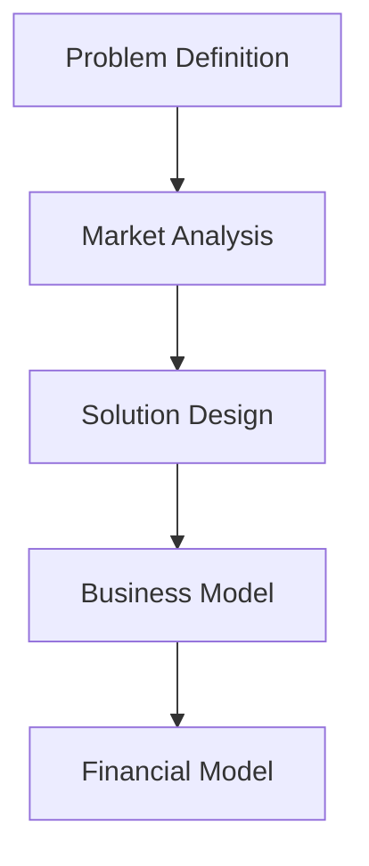
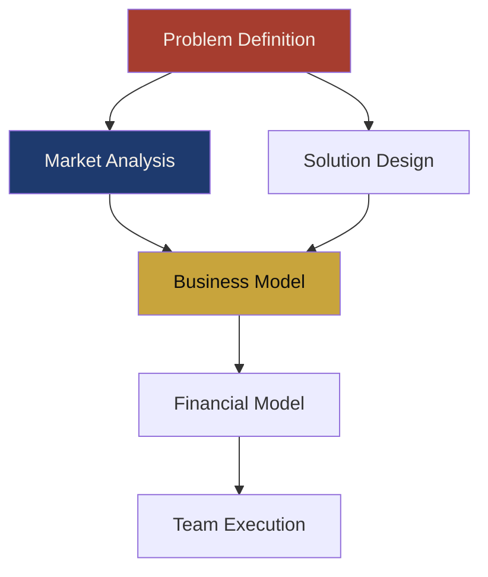
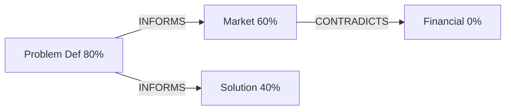

# Graphical Rendering Capabilities for MindrianOS

**Domain:** CLI/terminal graphical rendering for Claude Code plugin
**Researched:** 2026-03-26
**Overall confidence:** HIGH
**Mode:** Ecosystem + Feasibility

---

## Executive Summary

Claude Code **cannot render images, diagrams, or LaTeX inline**. Its output is streaming markdown text -- bold, italic, code blocks, tables, lists, blockquotes, and Unicode characters. That is the ceiling. No Mermaid rendering, no inline images, no Sixel/Kitty graphics protocol, no LaTeX math display. Multiple open feature requests (Issues #14375, #2266, #6389, #29254) confirm these are NOT implemented and have no assigned developers.

However, MindrianOS operates across **three rendering contexts** with very different capabilities, and the real power comes from **generating files that render elsewhere**:

1. **Claude's text responses** -- markdown only, cross-platform safe
2. **Bash tool output** (scripts/hooks) -- full ANSI color, Unicode, can generate files and open browser
3. **Browser rendering** (already proven with serve-dashboard) -- unlimited: Mermaid, D3.js, charts, LaTeX, interactive graphs

The winning strategy is a **hybrid approach**: use ASCII/Unicode art for quick inline terminal feedback, and generate HTML files opened in the browser for rich visualizations. The existing `serve-dashboard` pattern is the template. Mermaid diagrams should be written to `.md` files (renderable in GitHub/Obsidian/Notion) AND to HTML files openable in browser. LaTeX is not worth the complexity for MindrianOS's audience.

---

## Part 1: What Claude Code Can and Cannot Render

### Confirmed Working in Claude Code Text Output

| Element | Reliability | Notes |
|---------|-------------|-------|
| `**bold**` | Stable | Keep spans short (1-3 words), occasional misalignment during streaming |
| `*italic*` | Stable | |
| `` `inline code` `` | Stable | |
| Fenced code blocks | Stable | Syntax highlighting works, minor leading-space bug |
| `diff` code blocks | Stable | Shows +/- coloring |
| Tables (pipe syntax) | Works | Spacing can shift on Windows Terminal |
| Bulleted/numbered lists | Stable | |
| Blockquotes (`>`) | Stable | Single level only -- nesting levels look identical |
| Unicode characters | Stable | ALL Unicode renders, including box-drawing (U+2500 block) |
| `---` horizontal rules | Stable | |

**Source:** [Claude Code Issue #26390](https://github.com/anthropics/claude-code/issues/26390) -- confirmed ~40% of GFM features broken.

### Confirmed NOT Working

| Element | Status | Source |
|---------|--------|--------|
| `~~~mermaid` code blocks | Raw text, no diagram | [Issue #14375](https://github.com/anthropics/claude-code/issues/14375) -- open feature request, unassigned |
| `$...$` LaTeX math | Raw text, no rendering | Not supported in terminal markdown renderer |
| Inline images (Sixel/Kitty/iTerm2) | NOT supported | [Issue #2266](https://github.com/anthropics/claude-code/issues/2266), [#6389](https://github.com/anthropics/claude-code/issues/6389), [#29254](https://github.com/anthropics/claude-code/issues/29254) -- all open, unassigned |
| ~~Strikethrough~~ | Renders as literal tildes | |
| Headers h2-h6 hierarchy | All render as identical bold text | No visual hierarchy |
| Nested blockquotes | Nesting levels look identical | |
| Task lists `- [x]` | Render as plain bullets | State lost |
| ANSI escape codes in text | Garbage characters | Only work in Bash tool output |
| Link labels `[text](url)` | Raw URL shown, label discarded | |

**Confidence:** HIGH -- these are documented bugs and confirmed feature requests with no implementation timeline.

### The Three Rendering Contexts (from CLI-VISUAL-IDENTITY.md)

| Capability | Statusline (script) | Bash Tool Output | Claude Text Response |
|------------|---------------------|-------------------|---------------------|
| ANSI colors | YES | YES | NO |
| Unicode/box-drawing | YES | YES | YES |
| Bold/italic markdown | N/A | N/A | YES |
| Code blocks | N/A | N/A | YES |
| Tables | N/A | N/A | YES |
| Generate files | YES | YES | NO |
| Open browser | YES | YES | NO |
| Render images | NO | NO | NO |

---

## Part 2: Mermaid Diagrams -- The Full Picture

### Strategy: Three Output Channels

Mermaid is the highest-value graphical capability for MindrianOS. Use it through THREE channels:

#### Channel 1: ASCII/Unicode in Terminal (inline feedback)

**Tool:** `beautiful-mermaid` (npm)
**Confidence:** HIGH -- tested, active, TypeScript, zero DOM dependencies

```bash
npm install beautiful-mermaid
```

```typescript
import { renderMermaidASCII } from 'beautiful-mermaid'

const ascii = renderMermaidASCII(`graph LR; A --> B --> C`)
// Output:
// ┌───┐     ┌───┐     ┌───┐
// │ A │────>│ B │────>│ C │
// └───┘     └───┘     └───┘
```

**Supports:** Flowcharts, State, Sequence, Class, ER, XY Charts (6 types)
**Use for:** Quick room structure views, framework chains, stage progression -- rendered by a script, output piped to terminal via Bash tool.
**Cross-platform:** Pure TypeScript, no browser needed. Works on WSL2, macOS, Windows.

**Alternative:** `mermaid-ascii` (Go-based, the engine beautiful-mermaid ported from). Less convenient in a Node.js project.

#### Channel 2: Markdown Files with Mermaid Blocks (portable)

Write `.md` files containing fenced mermaid blocks. These render natively in:
- GitHub (README, PRs, issues, wiki)
- Obsidian
- Notion (paste as code block)
- VS Code with Mermaid extension
- Any markdown viewer with Mermaid support

```markdown

```

**Use for:** Room structure documentation, pipeline flowcharts, architecture diagrams in docs/
**No dependencies required.** Claude Code generates the markdown; the user's viewer renders it.

#### Channel 3: Browser Rendering via HTML (rich, interactive)

**Option A: claude-mermaid MCP Server** (RECOMMENDED for interactive use)

```bash
npm install -g claude-mermaid
claude mcp add --scope user mermaid claude-mermaid
```

Provides two MCP tools:
- `mermaid_preview` -- renders diagram in browser with live reload (WebSocket), pan/zoom
- `mermaid_save` -- saves to SVG/PNG/PDF

Live preview on ports 3737-3747 (auto-finds available port). SVG only for live reload; PNG/PDF for export.

**Confidence:** HIGH -- published npm package (v1.6.2), purpose-built for Claude Code, active development.

**Option B: mmdc (Mermaid CLI) for batch rendering**

```bash
npm install -g @mermaid-js/mermaid-cli
mmdc -i diagram.mmd -o diagram.svg
mmdc -i diagram.mmd -o diagram.png -t dark -b transparent
```

Renders to SVG/PNG/PDF. No live reload. Good for build pipelines and export scripts.
**Note:** Requires a Chromium/Puppeteer headless browser internally. Heavier dependency.

**Option C: Generate HTML + open browser** (matches existing pattern)

The `serve-dashboard` script already does this pattern. Extend it:

```bash
# scripts/render-diagram
#!/usr/bin/env bash
# Generate HTML with embedded Mermaid and open in browser

DIAGRAM_FILE="${1:-diagram.mmd}"
OUTPUT_DIR="${TMPDIR:-/tmp}/mindrian-diagrams"
mkdir -p "$OUTPUT_DIR"

cat > "$OUTPUT_DIR/diagram.html" << 'HTMLEOF'
<!DOCTYPE html>
<html>
<head>
  <script src="https://cdn.jsdelivr.net/npm/mermaid/dist/mermaid.min.js"></script>
  <style>body { background: #0D0D0D; padding: 2rem; }</style>
</head>
<body>
  <pre class="mermaid">
HTMLEOF
cat "$DIAGRAM_FILE" >> "$OUTPUT_DIR/diagram.html"
cat >> "$OUTPUT_DIR/diagram.html" << 'HTMLEOF'
  </pre>
  <script>mermaid.initialize({ theme: 'dark' });</script>
</body>
</html>
HTMLEOF

# Cross-platform browser open
if command -v xdg-open &>/dev/null; then
  xdg-open "$OUTPUT_DIR/diagram.html"
elif command -v open &>/dev/null; then
  open "$OUTPUT_DIR/diagram.html"
fi
```

**Confidence:** HIGH -- this pattern is already proven with serve-dashboard.

### Mermaid Diagram Types Relevant to MindrianOS

| Diagram Type | Mermaid Syntax | MindrianOS Use Case |
|-------------|----------------|---------------------|
| Flowchart | `graph TD/LR` | Room structure, pipeline flow, decision trees |
| Sequence | `sequenceDiagram` | Meeting conversation flow, agent interaction chains |
| Mindmap | `mindmap` | Framework relationships, brainstorming output |
| State | `stateDiagram-v2` | Venture stage progression, assumption validity states |
| Gantt | `gantt` | Milestone timeline, meeting schedule |
| ER | `erDiagram` | Knowledge graph schema, Neo4j relationship visualization |
| Class | `classDiagram` | Agent/skill architecture, component boundaries |
| Pie | `pie` | Section completeness, framework usage distribution |
| Quadrant | `quadrantChart` | Opportunity scoring (importance vs satisfaction) |
| Git graph | `gitGraph` | Room evolution history, version tracking |

### Recommendation

**Use all three channels.** For MindrianOS scripts:

1. **Inline (quick):** `beautiful-mermaid` renders ASCII in Bash tool output for immediate terminal feedback
2. **Portable (docs):** Write `.md` files with mermaid blocks to `room/` and `docs/` -- renderable everywhere
3. **Rich (interactive):** `claude-mermaid` MCP or generate HTML + open browser for deep exploration

---

## Part 3: LaTeX / Math Notation

### Verdict: NOT WORTH IT for MindrianOS

**Reasoning:**

1. **Claude Code cannot render LaTeX** in text output. `$x^2$` appears as literal text.
2. **KaTeX CLI** exists (`npx katex`) but outputs HTML, not terminal-renderable math.
3. **texlive** is a 2-5GB install. Not appropriate as a plugin dependency.
4. **The audience is non-technical teams.** Formal notation creates barriers, not clarity.

### What to Do Instead

For scoring formulas and grading rubrics, use **markdown tables and code blocks**:

```
HSI Score = (Weight_problem * Score_problem) + (Weight_market * Score_market) + ...

Section Weights:
  Problem Definition:    0.20
  Market Analysis:       0.15
  Solution Design:       0.20
  Business Model:        0.15
  Financial Model:       0.15
  Team Execution:        0.15
```

For Minto pyramid / MECE trees, use **indented markdown lists or Mermaid flowcharts**.

If a user specifically needs LaTeX output (academic context), generate `.tex` files and let them compile locally. Do not make LaTeX a core dependency.

**Confidence:** HIGH -- based on audience analysis and tool limitations.

---

## Part 4: Terminal Charts and Sparklines

### Recommended: asciichart + Custom Scripts

**For sparklines and line charts in Bash tool output:**

```bash
npm install asciichart
```

```javascript
const asciichart = require('asciichart');
const data = [3, 5, 7, 4, 8, 6, 9, 5, 7, 8, 10];
console.log(asciichart.plot(data, { height: 6 }));
```

Output:
```
   10.00 ┤        ╭
    9.00 ┤     ╭╮│
    8.00 ┤  ╭╮│╰╯
    7.00 ┤╭╯╰╯
    5.00 ┼╯
    3.00 ┤
```

**Confidence:** HIGH -- stable, zero dependencies, 6 years on npm, universal terminal support.

### For Richer Terminal Dashboards: blessed-contrib

```bash
npm install blessed blessed-contrib
```

Provides: sparklines, bar charts, line charts, gauges, maps, tables, logs, LCD displays.

**Caveat:** blessed is a full TUI framework. It takes over the terminal. NOT suitable for inline Claude Code output. Only use for dedicated dashboard scripts (like an enhanced `serve-dashboard` but terminal-native).

**Confidence:** MEDIUM -- powerful but heavy. Only if we build a dedicated TUI mode.

### For React-Based Terminal UI: Ink + ink-chart

```bash
npm install ink @pppp606/ink-chart
```

Components: BarChart, StackedBarChart, LineGraph, Sparkline.

**Caveat:** Same as blessed -- takes over the terminal. Would need a dedicated CLI app, not inline Claude Code output.

**Confidence:** MEDIUM -- excellent DX but architectural mismatch with Claude Code's streaming model.

### Practical Approach for MindrianOS

**Use asciichart in scripts** that output via Bash tool. Examples:

| Script | Chart Type | Data Source |
|--------|-----------|-------------|
| `compute-state` | Sparkline | Section completeness over time |
| `track-analytics` | Bar chart | Command usage frequency |
| `compute-meetings-intelligence` | Line chart | Meeting frequency timeline |
| `compute-opportunity-state` | Horizontal bars | Opportunity scores by section |

These scripts already exist. Adding chart output is a small enhancement -- pipe data through asciichart and append to the script's output.

---

## Part 5: Graph Visualization (Knowledge Graph / KuzuDB / Neo4j)

### Strategy: Two Tiers

#### Tier 1: ASCII Graph in Terminal (quick view)

**Tool:** Graphviz `dot` with `-Tascii` flag (requires Graphviz 13.0+ built with AAlib)

```bash
echo 'digraph { A -> B -> C; A -> C; }' | dot -Tascii
```

**Problem:** The `-Tascii` flag requires AAlib support at compile time. Most system packages do NOT include it. Not reliable as a dependency.

**Better alternative:** Generate a simple text representation in scripts:

```
Knowledge Graph Snapshot (12 nodes, 23 edges):

  [Problem Definition] --INFORMS--> [Market Analysis]
  [Problem Definition] --INFORMS--> [Solution Design]
  [Market Analysis] --CONTRADICTS--> [Financial Model]
  [Meeting 2026-03-15] --CONVERGES--> [Problem Definition, Market Analysis, Team]
```

This is what `build-graph` + `analyze-room` should output. Structured text, not ASCII art. Renderable as a table or indented list.

**Confidence:** HIGH -- simple, reliable, no dependencies.

#### Tier 2: Browser-Based Interactive Graph (deep exploration)

**This already exists:** `serve-dashboard` opens `dashboard/index.html` with graph.json data.

**Enhancement path:**
1. Use D3.js force-directed graph (already in dashboard or trivial to add)
2. Add Mermaid ER diagram generation for schema visualization
3. Add filtering/search in the browser UI
4. Generate from Neo4j/KuzuDB data via `build-graph` script

**For Neo4j specifically:** Query the graph, transform to D3 JSON format, serve in browser:

```javascript
// In build-graph script
const nodes = neo4jResults.map(r => ({ id: r.name, group: r.type }));
const links = neo4jResults.map(r => ({ source: r.from, target: r.to, type: r.rel }));
fs.writeFileSync('dashboard/graph.json', JSON.stringify({ nodes, links }));
```

**Confidence:** HIGH -- proven pattern, already implemented.

---

## Part 6: Browser-Based Rendering from CLI

### The Pattern (Already Proven)

MindrianOS already has `serve-dashboard` which:
1. Runs `build-graph` to generate fresh data
2. Starts Python http.server on port 8420-8430
3. Opens browser (WSL-aware with `xdg-open` / `open`)
4. Serves `dashboard/index.html`

### Extend This Pattern for All Rich Visualizations

Create a `scripts/render-viz` script that:

```
scripts/render-viz mermaid room-structure.mmd    # Opens Mermaid in browser
scripts/render-viz graph                          # Opens knowledge graph
scripts/render-viz chart venture-progress.json    # Opens D3 chart
scripts/render-viz report                         # Opens full HTML report
```

**Implementation:** Generate temporary HTML in `$TMPDIR/mindrian-viz/`, include CDN scripts (Mermaid, D3, Chart.js), open in browser. No server needed for static files.

### Cross-Platform Browser Opening

| Platform | Command | Notes |
|----------|---------|-------|
| Linux/WSL2 | `xdg-open` or `wslview` | WSL2 needs `wslview` from `wslu` package for Windows browser |
| macOS | `open` | Native |
| Windows (Git Bash) | `start` | Native |
| Node.js (any) | `open` npm package | Abstracts all platforms |

**Recommendation:** Use the `open` npm package in Node.js scripts for reliability. For bash scripts, use the existing WSL-aware detection from `serve-dashboard`.

**Confidence:** HIGH -- proven in production.

---

## Part 7: Markdown Files with Embedded Diagrams

### GitHub-Flavored Markdown (GFM) Mermaid Support

GitHub natively renders fenced mermaid code blocks in:
- README.md
- Pull request descriptions
- Issue descriptions
- Wiki pages
- Any `.md` file in the repo

This is FREE visualization. Claude Code generates `.md` files with mermaid blocks. Users view them on GitHub.

### Obsidian Support

Obsidian renders mermaid blocks natively. If MindrianOS room files are stored in an Obsidian vault, all mermaid diagrams render automatically.

### Practical Application

When MindrianOS generates room analysis or pipeline documentation, embed mermaid blocks:

```markdown
# Room Structure


```

**Confidence:** HIGH -- GitHub Mermaid support is stable since 2022. Obsidian support equally mature.

---

## Part 8: What About Claude Desktop and Cowork?

### Claude Desktop

- Renders markdown cleanly (web renderer, not terminal)
- Blockquotes get a left border bar (helps traces stand out)
- Mermaid code blocks: NOT rendered as diagrams (shown as code)
- LaTeX: NOT rendered
- Images: CAN be displayed inline (Desktop has image support, unlike CLI)

**Implication:** For Desktop, the best strategy is conversational text with embedded Mermaid code blocks. Users can copy-paste the mermaid to any viewer. Or use the claude-mermaid MCP which opens browser preview.

### Cowork

- Web-based renderer, similar to Desktop
- Shared output visible to all team members
- Same markdown support as Desktop
- Same Mermaid limitation (code blocks, not rendered diagrams)

**Implication:** Same strategy as Desktop. Text + code blocks + browser-based rich viz.

### Cross-Surface Strategy

| Visualization Need | CLI | Desktop | Cowork |
|-------------------|-----|---------|--------|
| Quick status | ASCII art via Bash tool | Markdown tables/blockquotes | Markdown tables/blockquotes |
| Framework chain | ASCII Mermaid (beautiful-mermaid) | Mermaid code block (copy to viewer) | Mermaid code block |
| Room structure | `build-graph` text output | Conversational description | Shared state file |
| Knowledge graph | Text list of relationships | Conversational summary | Shared graph.json |
| Deep exploration | `serve-dashboard` (browser) | claude-mermaid MCP (browser) | claude-mermaid MCP (browser) |
| Charts/progress | asciichart in scripts | Markdown tables | Markdown tables |
| Full report | HTML + open browser | HTML + open browser | HTML + open browser |

---

## Part 9: Recommended Stack

### Install Now (Tier 1 -- Core)

| Package | Purpose | Install |
|---------|---------|---------|
| `beautiful-mermaid` | ASCII Mermaid in terminal + SVG generation | `npm install beautiful-mermaid` |
| `asciichart` | Sparklines and line charts in terminal | `npm install asciichart` |
| `open` | Cross-platform browser opening | `npm install open` |

### Install When Needed (Tier 2 -- Enhanced)

| Package | Purpose | Install |
|---------|---------|---------|
| `claude-mermaid` | MCP server for live Mermaid preview in browser | `npm install -g claude-mermaid` |
| `@mermaid-js/mermaid-cli` | Batch Mermaid to PNG/SVG/PDF | `npm install -g @mermaid-js/mermaid-cli` |

### Do NOT Install

| Package | Why Not |
|---------|---------|
| `blessed` / `blessed-contrib` | Full TUI framework, architectural mismatch with Claude Code |
| `ink` / `ink-chart` | Same -- takes over terminal, not compatible with streaming output |
| `texlive` / `katex` (CLI) | 2-5GB, wrong audience, no terminal rendering |
| `graphviz` | `-Tascii` requires AAlib at compile time, unreliable |

---

## Part 10: MindrianOS Integration Plan

### New Scripts to Create

| Script | What It Does | Output |
|--------|-------------|--------|
| `scripts/render-diagram` | Takes .mmd file, renders to browser or ASCII | HTML in browser OR ASCII to stdout |
| `scripts/room-flowchart` | Generates Mermaid from room/STATE.md, renders | Mermaid .md file + optional browser |
| `scripts/venture-progress` | Generates sparkline/bar chart from section scores | ASCII chart to stdout |

### Existing Scripts to Enhance

| Script | Enhancement |
|--------|-------------|
| `scripts/compute-state` | Add sparkline of section completeness |
| `scripts/analyze-room` | Add Mermaid flowchart of cross-references |
| `scripts/build-graph` | Also generate .mmd file for Mermaid rendering |
| `scripts/serve-dashboard` | Add Mermaid tab for pipeline/architecture diagrams |

### Command Integration

When MindrianOS commands produce structural output, include mermaid blocks:

```markdown
## /mos:room status

Section completeness:

  Problem Definition:  ████████░░ 80%
  Market Analysis:     ██████░░░░ 60%
  Solution Design:     ████░░░░░░ 40%
  Business Model:      ██░░░░░░░░ 20%
  Financial Model:     ░░░░░░░░░░  0%

Cross-references found: 7



> Run `/mos:room diagram` to open interactive graph in browser.
```

### Dashboard Enhancement

The existing `dashboard/index.html` can embed Mermaid.js alongside D3.js:

```html
<script src="https://cdn.jsdelivr.net/npm/mermaid/dist/mermaid.min.js"></script>
```

Add a "Pipeline" tab that shows the current venture's pipeline as an interactive Mermaid diagram alongside the D3 force graph.

---

## Part 11: What Actually Matters (Prioritized)

### High Value, Low Effort

1. **Mermaid in .md files** -- zero dependencies, renders on GitHub/Obsidian/Notion. Just generate the right markdown.
2. **beautiful-mermaid for ASCII** -- one npm install, ASCII flowcharts in terminal scripts.
3. **asciichart for sparklines** -- one npm install, progress visualization in existing scripts.
4. **HTML + open browser** -- extend serve-dashboard pattern for any rich visualization.

### High Value, Medium Effort

5. **claude-mermaid MCP** -- install once, live diagram preview in browser from any Claude Code session.
6. **render-diagram script** -- utility script for on-demand Mermaid rendering.
7. **Dashboard Mermaid tab** -- add pipeline visualization to existing dashboard.

### Low Value for Now

8. **Ink/blessed terminal dashboards** -- architectural mismatch, defer until dedicated TUI mode.
9. **LaTeX** -- wrong audience, no terminal rendering, defer indefinitely.
10. **Graphviz ASCII** -- unreliable dependency, use Mermaid instead.
11. **Sixel/Kitty inline images** -- Claude Code doesn't support it, no timeline for support.

---

## Confidence Assessment

| Area | Confidence | Reason |
|------|------------|--------|
| Claude Code rendering limits | HIGH | Documented bugs, confirmed issues, tested in production |
| Mermaid ecosystem (mmdc, beautiful-mermaid, claude-mermaid) | HIGH | Active npm packages, tested, well-documented |
| ASCII chart libraries (asciichart) | HIGH | Stable, zero-dependency, widely used |
| Browser-based rendering pattern | HIGH | Already proven with serve-dashboard |
| LaTeX verdict (skip it) | HIGH | Clear audience mismatch, no terminal support |
| Inline image protocols (Sixel/Kitty) | HIGH (that it does NOT work) | Multiple open issues, no implementation |
| Cross-surface strategy | MEDIUM | Desktop/Cowork rendering verified conceptually, not all paths tested |
| Ink/blessed feasibility | MEDIUM | Libraries work, but integration with Claude Code streaming untested |

---

## Sources

### Claude Code Capabilities
- [Mermaid rendering feature request (Issue #14375)](https://github.com/anthropics/claude-code/issues/14375) -- open, unassigned
- [Sixel/Kitty graphics (Issue #2266)](https://github.com/anthropics/claude-code/issues/2266) -- open, unassigned
- [Terminal image display (Issue #6389)](https://github.com/anthropics/claude-code/issues/6389) -- open, unassigned
- [iTerm2/Sixel inline images (Issue #29254)](https://github.com/anthropics/claude-code/issues/29254) -- open, unassigned
- [GFM rendering bugs (Issue #26390)](https://github.com/anthropics/claude-code/issues/26390) -- ~40% of GFM broken

### Mermaid Tools
- [claude-mermaid MCP Server](https://github.com/veelenga/claude-mermaid) -- MCP server for live Mermaid preview
- [beautiful-mermaid npm](https://www.npmjs.com/package/beautiful-mermaid) -- SVG + ASCII dual output, TypeScript
- [mermaid-ascii](https://github.com/AlexanderGrooff/mermaid-ascii) -- Go-based ASCII renderer (upstream of beautiful-mermaid)
- [@mermaid-js/mermaid-cli](https://www.npmjs.com/package/@mermaid-js/mermaid-cli) -- official Mermaid CLI (mmdc)

### Chart Libraries
- [asciichart](https://github.com/kroitor/asciichart) -- zero-dependency ASCII line charts
- [blessed-contrib](https://github.com/yaronn/blessed-contrib) -- terminal dashboard widgets
- [ink-chart](https://github.com/pppp606/ink-chart) -- React terminal visualization components
- [Ink](https://github.com/vadimdemedes/ink) -- React for CLI

### Graph Visualization
- [Graphviz ASCII output docs](https://graphviz.org/docs/outputs/ascii/) -- requires AAlib, Graphviz 13.0+
- [dot-to-ascii](https://github.com/ggerganov/dot-to-ascii) -- Graphviz to ASCII via Graph::Easy

### Browser Opening
- [open npm package](https://github.com/sindresorhus/open) -- cross-platform URL/file opener

### LaTeX
- [KaTeX CLI](https://katex.org/docs/cli) -- outputs HTML, not terminal-renderable
