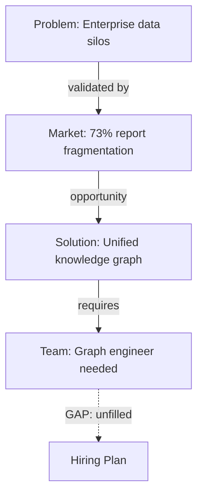

# Generative UI for MindrianOS - Deep Research Report

**Date:** 2026-03-29
**Purpose:** Evaluate Vercel AI SDK, generative UI patterns, and related technologies for building MindrianOS's interactive Data Room interface.

---

## Table of Contents

1. [Vercel AI SDK - Architecture & Core APIs](#1-vercel-ai-sdk)
2. [The Generative UI Pattern - State of the Art](#2-generative-ui-pattern)
3. [json-render & Declarative UI Specs](#3-json-render-and-declarative-ui)
4. [Data Room Visualization Patterns](#4-data-room-visualization)
5. [Static vs Server Architecture](#5-static-vs-server)
6. [Open Source Alternatives](#6-open-source-alternatives)
7. [The MindrianOS Opportunity](#7-the-mindrianos-opportunity)
8. [Recommended Architecture & Build Plan](#8-recommended-architecture)

---

## 1. Vercel AI SDK

### What It Is

The Vercel AI SDK (`ai` package, currently v6.0.141) is an open-source TypeScript library for building AI-powered applications. It provides a unified API across all major LLM providers (OpenAI, Anthropic, Google, etc.) with first-class streaming, tool calling, structured output, and UI integration.

**The SDK is free and open-source (Apache 2.0).** Costs come only from the underlying LLM provider you choose.

### Core Client Hooks

```typescript
// useChat - conversational interface with message history
const { messages, input, handleSubmit, isLoading } = useChat({
  api: '/api/chat',  // or a Server Action in SDK 6
});

// useCompletion - single-prompt completion (no history)
const { completion, input, handleSubmit } = useCompletion({
  api: '/api/completion',
});

// useAssistant - OpenAI Assistants API integration
const { messages, input, handleSubmit } = useAssistant({
  api: '/api/assistant',
});
```

### SDK 6 Key Changes

AI SDK 6 replaces REST-based `/api/chat` endpoints with native **Server Actions** for AI inference. The `useChat` hook connects directly to Server Actions instead of REST endpoints, providing end-to-end type safety. The hook also supports **flexible transports** - you can swap the default fetch-based transport for WebSockets or even connect directly to LLM providers for client-only apps.

### Tool Calling + UI Rendering

This is the critical pattern for MindrianOS. The AI calls a tool, the tool returns structured data, and the client renders a React component:

**Server (Route Handler):**
```typescript
import { streamText } from 'ai';

export async function POST(req: Request) {
  const { messages } = await req.json();

  const result = streamText({
    model: openai('gpt-4o'),
    messages,
    tools: {
      showKnowledgeGraph: {
        description: 'Display a knowledge graph visualization for the room',
        parameters: z.object({
          nodes: z.array(z.object({
            id: z.string(),
            label: z.string(),
            type: z.enum(['section', 'entity', 'concept']),
          })),
          edges: z.array(z.object({
            source: z.string(),
            target: z.string(),
            relationship: z.string(),
          })),
          highlightPath: z.array(z.string()).optional(),
        }),
        execute: async ({ nodes, edges, highlightPath }) => {
          // Return structured data - the CLIENT renders the component
          return { nodes, edges, highlightPath };
        },
      },
    },
  });

  return result.toUIMessageStreamResponse();
}
```

**Client:**
```tsx
const { messages } = useChat();

// Render tool results as components
{messages.map(message => (
  <div key={message.id}>
    {message.content}
    {message.toolInvocations?.map(tool => {
      if (tool.toolName === 'showKnowledgeGraph' && tool.state === 'result') {
        return <KnowledgeGraph key={tool.toolCallId} data={tool.result} />;
      }
      if (tool.state !== 'result') {
        return <LoadingSkeleton key={tool.toolCallId} />;
      }
    })}
  </div>
))}
```

### Structured Output (JSON)

AI SDK provides `generateObject` and `streamObject` for getting typed JSON from models:

```typescript
const { object } = await generateObject({
  model: openai('gpt-4o'),
  schema: z.object({
    graphConfig: z.object({
      layout: z.enum(['force-directed', 'hierarchical', 'radial']),
      filters: z.array(z.string()),
      highlightedNodes: z.array(z.string()),
    }),
    explanation: z.string(),
  }),
  prompt: 'Show contradictions in pricing section',
});
```

### The RSC / streamUI Deprecation

**Important finding:** The original `ai/rsc` module (`streamUI`, `createStreamableUI`) that rendered React Server Components on the server side is now **marked experimental and not recommended for production**. Known issues include:
- Components remount on `.done()`, causing flicker
- Quadratic data transfer with `createStreamableUI`
- Cannot abort streams from server actions
- Multiple suspense boundaries can crash

**The new recommended pattern** (as of SDK 5+) is: `streamText` on server, `useChat` on client, tool invocations render components client-side. This is what v0.dev itself uses internally.

---

## 2. The Generative UI Pattern

### What It Means

Instead of AI returning only text, it returns instructions to render interactive UI components - charts, cards, graphs, tables, forms. The user gets a visual, interactive response.

### Three Approaches (2026 Consensus)

| Approach | How It Works | Control | Flexibility |
|---|---|---|---|
| **Static** (AG-UI) | Frontend owns all components. AI picks which to show and fills props. | Maximum | Low |
| **Declarative** (A2UI, json-render) | AI returns structured JSON spec. Frontend renders with its own styling. | High | Medium |
| **Open-ended** (MCP Apps) | AI returns a full UI surface. Frontend mainly hosts it. | Low | Maximum |

### How Products Do This Today

- **ChatGPT Canvas**: Open-ended approach. AI generates and edits code/documents in a side panel. Custom renderer, not reusable.
- **Anthropic Artifacts**: Open-ended. Claude generates full HTML/React components rendered in a sandboxed iframe. Powerful but not composable.
- **v0.dev**: Declarative then exported. AI generates shadcn/ui components from prompts. Uses json-render internally. Components are exported as standalone code.
- **Cursor/Windsurf**: Code-generation approach. AI writes code directly into your editor. Not runtime generative UI.

### BYOAPI (Bring Your Own Key)

Yes, this is fully viable. The AI SDK supports direct provider connections. Tambo explicitly supports BYOAPI with OpenAI, Anthropic, Gemini, Mistral, and any OpenAI-compatible provider. The key architectural requirement is that API keys should pass through a server-side proxy (even a thin one) to avoid exposing them in client-side JavaScript.

---

## 3. json-render & Declarative UI Specs

### Vercel json-render (NEW - March 2026)

This is the most significant recent development. Vercel open-sourced the framework that powers v0.dev's generative UI. 13,000+ GitHub stars since January 2026.

**Core concept:** Developers define a catalog of permitted components using Zod schemas. The LLM generates constrained JSON matching that catalog. A renderer maps JSON to real React components.

```typescript
// 1. Define the catalog
import { defineCatalog, defineSchema } from '@json-render/core';

const catalog = defineCatalog(schema, {
  components: {
    MondrianGrid: {
      props: z.object({
        sections: z.array(z.object({
          id: z.string(),
          title: z.string(),
          color: z.enum(['red', 'blue', 'yellow', 'white']),
          span: z.number(),
          content: z.string(),
        })),
      }),
      description: 'A Mondrian-style grid layout for data room sections',
    },
    GraphView: {
      props: z.object({
        nodes: z.array(z.object({ id: z.string(), label: z.string(), type: z.string() })),
        edges: z.array(z.object({ source: z.string(), target: z.string(), label: z.string() })),
        layout: z.enum(['force', 'hierarchical', 'radial']),
      }),
      description: 'Interactive knowledge graph visualization',
    },
    AnalysisCard: {
      props: z.object({
        title: z.string(),
        finding: z.string(),
        severity: z.enum(['info', 'warning', 'critical']),
        evidence: z.array(z.string()),
      }),
      description: 'Card showing an analysis finding with evidence',
    },
  },
});

// 2. Register implementations
const { registry } = defineRegistry(catalog, {
  components: {
    MondrianGrid: ({ props }) => <MondrianGridComponent sections={props.sections} />,
    GraphView: ({ props }) => <CytoscapeGraph {...props} />,
    AnalysisCard: ({ props }) => <FindingCard {...props} />,
  },
});

// 3. Render AI-generated spec
<Renderer spec={aiGeneratedSpec} registry={registry} />
```

**The AI generates this JSON:**
```json
{
  "root": "grid-1",
  "elements": {
    "grid-1": {
      "type": "MondrianGrid",
      "props": {
        "sections": [
          { "id": "problem", "title": "Problem Definition", "color": "red", "span": 2, "content": "..." },
          { "id": "market", "title": "Market Analysis", "color": "blue", "span": 1, "content": "..." }
        ]
      },
      "children": ["analysis-1"]
    },
    "analysis-1": {
      "type": "AnalysisCard",
      "props": {
        "title": "Pricing Contradiction",
        "finding": "Market analysis suggests premium pricing but team section indicates cost-sensitive target",
        "severity": "warning",
        "evidence": ["market-analysis/section-3", "team/pricing-strategy"]
      }
    }
  }
}
```

**Key features:**
- 39 pre-built shadcn/ui components included
- Multi-framework: React, Vue, Svelte, Solid, React Native
- Progressive streaming as JSON arrives from model
- Code export - generate standalone Next.js projects
- Data binding with `$state`, `$item`, `$index`
- Built-in charts: BarGraph, LineGraph

### Google A2UI (February 2026)

A2UI is a declarative JSON protocol where agents generate UI as structured JSONL. Currently v0.8 (public preview).

**Key difference from json-render:** A2UI is framework-agnostic at the protocol level. The same JSON payload renders on React, Flutter, SwiftUI, or any client. It uses a flat component list with ID references (no nested tree), which is easier for LLMs to generate incrementally.

**Security model:** Declarative-only. Agents can only assemble components from a client-controlled catalog. No executable code.

```json
{
  "surfaceId": "data-room",
  "components": [
    {
      "id": "graph-view",
      "component": "GraphView",
      "properties": { "layout": "force-directed", "filter": "contradictions" }
    },
    {
      "id": "submit-btn",
      "component": "Button",
      "child": "submit-text",
      "action": { "event": { "name": "apply_filter" } }
    }
  ]
}
```

### AG-UI Protocol (CopilotKit)

AG-UI is not a UI spec itself - it is the **transport layer** that sits underneath A2UI, json-render, or any other generative UI approach. It defines how UI updates, agent state, and user interactions flow in real time between agent and frontend. Oracle, Google, and CopilotKit have jointly standardized this.

---

## 4. Data Room Visualization Patterns

### Can AI Generate Cytoscape.js Configs?

**Yes, absolutely.** Cytoscape.js configs are JSON, which is exactly what structured output excels at. The pattern:

```typescript
tools: {
  generateGraphView: {
    description: 'Generate an interactive knowledge graph from room data',
    parameters: z.object({
      query: z.string(),
      filterType: z.enum(['all', 'contradictions', 'connections', 'gaps']),
    }),
    execute: async ({ query, filterType }) => {
      // Fetch from KuzuDB/room data
      const graphData = await queryKnowledgeGraph(query, filterType);

      return {
        elements: {
          nodes: graphData.nodes.map(n => ({
            data: { id: n.id, label: n.label, type: n.type, color: typeColors[n.type] }
          })),
          edges: graphData.edges.map(e => ({
            data: { source: e.from, target: e.to, label: e.relationship }
          })),
        },
        layout: { name: 'cose-bilkent' },
        style: cytoscapeStylesheet,
        highlightPath: graphData.highlightPath,
      };
    },
  },
}
```

Client renders:
```tsx
if (tool.toolName === 'generateGraphView') {
  return <CytoscapeGraph config={tool.result} onNodeClick={handleNodeClick} />;
}
```

### Can AI Generate Mermaid Diagrams Dynamically?

**Yes.** Mermaid syntax is text-based and LLMs generate it reliably. Two approaches:

1. **Direct generation:** AI returns Mermaid syntax as text, client renders with `mermaid.render()`
2. **Structured then rendered:** AI returns structured flow data, you convert to Mermaid syntax client-side

```typescript
tools: {
  showFlowDiagram: {
    description: 'Show a flow diagram connecting room sections',
    parameters: z.object({
      startSection: z.string(),
      endSection: z.string(),
    }),
    execute: async ({ startSection, endSection }) => {
      const path = await findPath(startSection, endSection);
      const mermaidSyntax = `graph TD\n${path.map(
        (step, i) => i < path.length - 1
          ? `    ${step.id}[${step.label}] -->|${step.relationship}| ${path[i+1].id}[${path[i+1].label}]`
          : ''
      ).join('\n')}`;
      return { mermaid: mermaidSyntax, explanation: path.explanation };
    },
  },
}
```

### Conversational Data Room Queries

These MindrianOS interactions map directly to tool calls:

| User Says | Tool Called | UI Rendered |
|---|---|---|
| "Show me contradictions" | `findContradictions` | Filtered graph view + AnalysisCard list |
| "What connects market analysis to team?" | `findPath` | Path visualization with Mermaid/Cytoscape |
| "Show me my data room" | `getRoomOverview` | Mondrian grid with section summaries |
| "What's missing from my solution?" | `gapAnalysis` | Gap analysis card + suggested sections |
| "Compare my pricing to competitors" | `crossReference` | Comparison table + insight cards |

---

## 5. Static vs Server Architecture

### Does Generative UI Require a Server?

**Short answer: Yes, but the server can be extremely thin.**

| Approach | Server Required? | Details |
|---|---|---|
| AI SDK `streamUI` (RSC) | Yes, Next.js App Router | **Deprecated.** Do not use. |
| AI SDK `useChat` + tools | Yes, route handler or Server Action | Recommended. Server proxies LLM calls. |
| json-render | No server for rendering. Yes for AI generation. | Catalog + renderer is client-side. AI generation needs server. |
| A2UI | No server for rendering. Agent needs server. | Same split. |
| Client-only (BYOAPI) | Technically no, but insecure. | API keys exposed in browser. Not for production. |

### The Thin Server Pattern

For MindrianOS, the ideal architecture is:

```
Static Site (Vercel/Cloudflare)     Thin API (Edge Function)      LLM Provider
+---------------------------+       +------------------+          +----------+
| React + json-render       | ----> | API key proxy    | -------> | Claude   |
| Cytoscape.js              |       | Rate limiting    |          | GPT-4o   |
| Mermaid                   |       | Room data access |          +----------+
| De Stijl components       |       +------------------+
+---------------------------+
```

### Deployment Options

**Vercel (recommended for this stack):**
- Free tier: Serverless functions with 10s timeout (Hobby), 300s (Pro at $20/mo)
- Edge Functions for the API proxy - fast, globally distributed
- Native Next.js support, AI SDK is their own product
- AI SDK 6 Server Actions work natively

**Cloudflare Workers (alternative):**
- Workers have 30s CPU time on free, 15min on paid ($5/mo)
- Better for long-running agent calls
- No native Next.js RSC support (use static export + Workers for API)
- Cloudflare has their own AI gateway

**Render / Railway:**
- Full Node.js server, no timeout issues
- More control but more ops burden

### Can It Read from a GitHub Repo?

**Yes.** The room data (markdown files in `room/` directory) can be:
1. Read at build time via GitHub API during `next build`
2. Read at runtime via GitHub API in route handlers
3. Cloned into the deployment via build step
4. Synced to a KuzuDB/Pinecone index that the API queries

Option 3 or 4 is best for MindrianOS - the room data becomes the AI's context.

---

## 6. Open Source Alternatives

### Comparison Table

| Framework | Approach | Server Required | BYOAPI | Maturity | Best For |
|---|---|---|---|---|---|
| **Vercel AI SDK** | Tool-based generative UI | Yes (thin) | Yes | Production (v6) | Full-stack AI apps |
| **json-render** | Declarative catalog + JSON | Rendering: No | N/A (rendering only) | New (Jan 2026) | AI-generated dashboards |
| **Tambo** | Component registration + Zod | Yes (hosted) | Yes | 1.0 (2026) | Quick generative UI |
| **CopilotKit** | AG-UI protocol runtime | Yes | Yes | Production | Enterprise agent UIs |
| **assistant-ui** | Chat UI primitives | No (UI only) | N/A | Production | Chat interfaces |
| **A2UI (Google)** | Declarative JSON protocol | Agent: Yes | N/A (protocol) | Preview (v0.8) | Cross-platform agents |
| **LangGraph.js** | useStream + tool UI | Yes (LangGraph Cloud) | Via LangGraph | Production | Complex agent workflows |

### Detailed Notes

**json-render** is the strongest fit for MindrianOS because:
- You define exactly which components Larry can generate (MondrianGrid, GraphView, etc.)
- The catalog constraint means Larry cannot generate broken or unsafe UI
- Progressive streaming renders components as they arrive
- 39 shadcn/ui components out of the box, plus custom components
- Same catalog works for React and React Native (future mobile)
- Code export means generated dashboards can become standalone

**Tambo** is interesting as a simpler alternative:
```typescript
// Register component
registerComponent({
  name: 'DataRoomGrid',
  description: 'Mondrian-style grid showing room sections',
  schema: z.object({
    sections: z.array(z.object({ title: z.string(), status: z.string() })),
  }),
  component: DataRoomGrid,
});

// Agent automatically picks and renders the right component
```

**assistant-ui** is the best chat UI layer regardless of which generative UI approach you choose. It provides the message thread, input, streaming display, tool call rendering, and keyboard shortcuts. It integrates with AI SDK, LangGraph, and custom backends.

---

## 7. The MindrianOS Opportunity

### The Vision: Larry Generates the View

Instead of building static dashboard views, Larry (the AI) **generates the appropriate visualization** based on what the user asks. The Data Room becomes a conversational, dynamic interface.

### Interaction Examples

**"Show me my data room"**
Larry reads the room/ directory, identifies sections and their completeness, and generates:
```
+--MondrianGrid---------+--AnalysisCard--------+
| Problem [RED]   2/3   | Room Health: 72%     |
| Market [BLUE]   3/3   | Missing: Financial   |
| Solution [YELLOW] 1/3 | projections, Team    |
| Team [WHITE]    0/3   | section empty        |
+--------+--------------+----------------------+
| GraphView: Section relationships             |
| [problem] --informs--> [solution]            |
| [market] --validates--> [problem]            |
| [team] (isolated - no connections)           |
+----------------------------------------------+
```

**"What contradicts my pricing?"**
Larry queries the knowledge graph, finds contradictions, and generates:
- A filtered Cytoscape graph showing only contradiction edges (red)
- AnalysisCards for each contradiction with evidence links
- A suggested resolution path

**"Show the flow from problem to solution"**
Larry generates a Mermaid flow diagram:


**"Compare our approach to competitors"**
Larry generates a comparison table component with data from the room's market analysis, plus insight cards highlighting differentiation.

### Why This Is Powerful for MindrianOS

1. **No fixed UI to maintain.** The interface adapts to whatever the user needs.
2. **Every view is contextual.** Larry knows the room structure, the KuzuDB graph, the Brain enrichment.
3. **Progressive disclosure.** Users start with a question, not a complex dashboard.
4. **The catalog constrains quality.** Larry can only use components you've designed and approved.
5. **Export capability.** A generated dashboard can be exported as a standalone investor deck view.

---

## 8. Recommended Architecture & Build Plan

### Tech Stack

```
Framework:     Next.js 15 App Router
UI Library:    shadcn/ui + AI Elements + custom De Stijl components
AI Layer:      Vercel AI SDK 6 (useChat + streamText + tools)
Gen UI:        json-render (component catalog) OR tool-based rendering
Chat UI:       assistant-ui (composable chat primitives)
Graph Viz:     Cytoscape.js (knowledge graph) + Mermaid (flow diagrams)
Graph DB:      KuzuDB (local) / Neo4j (remote)
Vector Store:  Pinecone (pws-brain index)
Deployment:    Vercel (static + Edge Functions)
Auth:          None initially (single user), later Clerk/NextAuth
```

### Architecture Diagram

```
User Browser
+--------------------------------------------------+
| assistant-ui (chat thread)                        |
|   useChat() <-----> /api/chat (Server Action)     |
|                         |                         |
| json-render Renderer    |   streamText() + tools  |
|   MondrianGrid          |     |                   |
|   GraphView (Cytoscape) |     +-> Claude/GPT-4o   |
|   FlowDiagram (Mermaid) |     |                   |
|   AnalysisCard          |     +-> KuzuDB query    |
|   ComparisonTable       |     |                   |
|   GapAnalysis           |     +-> Pinecone search  |
|   SectionEditor         |     |                   |
+--------------------------------------------------+
                                |
                          Vercel Edge Function
                          (API key proxy + room data)
```

### Two Viable Approaches

**Approach A: Tool-Based Generative UI (Simpler, Recommended to Start)**

The AI SDK tool calling pattern. Each tool returns structured data, client renders the matching component. No json-render dependency.

```typescript
// Server: define tools that return visualization configs
const tools = {
  showRoomOverview: { /* returns grid config */ },
  showGraph: { /* returns cytoscape config */ },
  showContradictions: { /* returns filtered graph + cards */ },
  showFlowDiagram: { /* returns mermaid syntax */ },
  showGapAnalysis: { /* returns gap list + suggestions */ },
};

// Client: map tool results to components
function ToolRenderer({ invocation }) {
  const renderers = {
    showRoomOverview: (data) => <MondrianGrid {...data} />,
    showGraph: (data) => <CytoscapeGraph {...data} />,
    showContradictions: (data) => <ContradictionView {...data} />,
    showFlowDiagram: (data) => <MermaidDiagram {...data} />,
    showGapAnalysis: (data) => <GapAnalysisView {...data} />,
  };
  return renderers[invocation.toolName]?.(invocation.result) ?? null;
}
```

**Approach B: json-render Catalog (More Powerful, More Investment)**

Define a full component catalog. The AI generates arbitrary compositions of your components. More flexible but requires more upfront catalog design.

Best for: when you want Larry to compose novel layouts (e.g., a grid with an embedded graph and cards arranged in a specific way the user asked for).

### Build Phases

| Phase | Work | Timeline |
|---|---|---|
| **Phase 1: Chat + Tools** | Next.js app, useChat, 3-4 tools (room overview, graph, flow diagram), basic De Stijl components | 1-2 weeks |
| **Phase 2: Rich Visualization** | Cytoscape.js integration, Mermaid rendering, contradiction detection, gap analysis tools | 1-2 weeks |
| **Phase 3: json-render Catalog** | Define full component catalog, enable AI-composed layouts, progressive streaming | 1-2 weeks |
| **Phase 4: Room Integration** | Read from room/ directory, KuzuDB queries, Pinecone Brain enrichment, REASONING.md integration | 1-2 weeks |
| **Phase 5: Polish** | assistant-ui chat primitives, keyboard shortcuts, export to PDF/HTML, mobile responsive | 1 week |

**Total estimate: 5-9 weeks** depending on scope and polish level.

### Minimal Viable Start (1 Week)

If you want to prove the concept fast:

```bash
npx create-next-app@latest mindrianos-dataroom --typescript --tailwind --app
cd mindrianos-dataroom
npx shadcn@latest init
npm install ai @ai-sdk/anthropic zod
```

Build a single page with:
1. `useChat` connected to a route handler
2. One tool: `showRoomOverview` that reads `room/` and returns section summaries
3. One component: `MondrianGrid` that renders the sections in De Stijl style
4. Deploy to Vercel

This proves: "user asks a question, Larry generates a visual Data Room view."

### Cost Implications

- **Vercel AI SDK:** Free (open source)
- **json-render:** Free (Apache 2.0)
- **assistant-ui:** Free (open source), paid cloud features optional
- **Vercel hosting:** Free tier works for development. Pro ($20/mo) for production timeouts.
- **LLM costs:** The main variable. Claude Sonnet 4 at ~$3/M input, $15/M output. A typical room overview generation with tool calling would cost $0.01-0.05 per interaction.
- **Pinecone:** Free tier (100K vectors). Already in use.
- **KuzuDB:** Free (embedded, local).

### Key Decision: json-render vs Pure Tool Calling

| Factor | Tool Calling | json-render |
|---|---|---|
| Setup complexity | Low | Medium |
| Component composition | Fixed (one tool = one component) | Flexible (AI composes freely) |
| Streaming | Tool results arrive complete | Progressive element-by-element |
| Novel layouts | No (predefined) | Yes (AI arranges components) |
| Safety | Implicit (you wrote the tools) | Explicit (catalog constrains) |
| Dependency | Just AI SDK | AI SDK + json-render |

**Recommendation:** Start with tool calling (Approach A). It is simpler, proven, and sufficient for the core Data Room experience. Migrate to json-render (Approach B) when you need Larry to compose novel dashboard layouts - which becomes valuable when you have 10+ components and want the AI to arrange them creatively.

---

## Key Takeaways

1. **The RSC/streamUI approach is deprecated.** Do not build on `ai/rsc`. Use `streamText` + `useChat` + client-side tool rendering.

2. **json-render is the most exciting new primitive.** It is literally how v0.dev works, now open-sourced. It lets you define a safe catalog of components that AI can compose into dynamic interfaces.

3. **A server is required, but it can be a single Edge Function.** The server's job is API key management, room data access, and proxying LLM calls. Everything else renders client-side.

4. **The tool-calling pattern is production-ready today.** Define tools that return structured data, render components client-side. This is how the industry builds generative UI in 2026.

5. **MindrianOS is perfectly positioned for this.** The Data Room structure (sections, knowledge graph, REASONING.md files) maps directly to tool parameters and component props. Larry already understands the room - now it can generate visual interfaces for it.

6. **Build time is weeks, not months.** A proof-of-concept is 1 week. A production-quality Data Room viewer with graph, flow diagrams, and gap analysis is 5-9 weeks.

---

## Sources

- [Vercel AI SDK Documentation](https://ai-sdk.dev/docs/introduction)
- [AI SDK 6 Announcement](https://vercel.com/blog/ai-sdk-6)
- [Introducing AI SDK 3.0 with Generative UI](https://vercel.com/blog/ai-sdk-3-generative-ui)
- [AI SDK RSC: createStreamableUI Reference](https://ai-sdk.dev/docs/reference/ai-sdk-rsc/create-streamable-ui)
- [Migrating from RSC to UI](https://ai-sdk.dev/docs/ai-sdk-rsc/migrating-to-ui)
- [Rendering UI with Language Models](https://ai-sdk.dev/docs/advanced/rendering-ui-with-language-models)
- [Vercel AI Elements](https://vercel.com/changelog/introducing-ai-elements)
- [AI Elements GitHub](https://github.com/vercel/ai-elements)
- [json-render Official Site](https://json-render.dev/)
- [json-render GitHub](https://github.com/vercel-labs/json-render)
- [Vercel Releases json-render - InfoQ](https://www.infoq.com/news/2026/03/vercel-json-render/)
- [json-render - The New Stack](https://thenewstack.io/vercels-json-render-a-step-toward-generative-ui/)
- [Google A2UI](https://a2ui.org/)
- [Introducing A2UI - Google Developers Blog](https://developers.googleblog.com/introducing-a2ui-an-open-project-for-agent-driven-interfaces/)
- [A2UI Complete Guide - DEV Community](https://dev.to/czmilo/the-complete-guide-to-a2ui-protocol-building-agent-driven-uis-with-googles-a2ui-in-2026-146p)
- [CopilotKit Developer's Guide to Generative UI 2026](https://www.copilotkit.ai/blog/the-developer-s-guide-to-generative-ui-in-2026)
- [AG-UI Protocol - CopilotKit](https://www.copilotkit.ai/blog/introducing-ag-ui-the-protocol-where-agents-meet-users)
- [CopilotKit GitHub](https://github.com/CopilotKit/CopilotKit)
- [Tambo - Generative UI SDK](https://github.com/tambo-ai/tambo)
- [Tambo Documentation](https://docs.tambo.co/)
- [assistant-ui](https://www.assistant-ui.com/)
- [assistant-ui GitHub](https://github.com/assistant-ui/assistant-ui)
- [LangGraph Generative UI - React](https://docs.langchain.com/langsmith/generative-ui-react)
- [LangGraph.js Gen UI Examples](https://github.com/langchain-ai/langgraphjs-gen-ui-examples)
- [LangChain + assistant-ui Integration](https://blog.langchain.com/assistant-ui/)
- [Multi-Step & Generative UI - Vercel Academy](https://vercel.com/academy/ai-sdk/multi-step-and-generative-ui)
- [Generative UI Chatbot Template](https://vercel.com/templates/next.js/rsc-genui)
- [Complete Guide to Generative UI Frameworks 2026 - Medium](https://medium.com/@akshaychame2/the-complete-guide-to-generative-ui-frameworks-in-2026-fde71c4fa8cc)
- [Vercel AI SDK without NextJS - GitHub Discussion](https://github.com/orgs/community/discussions/177224)
