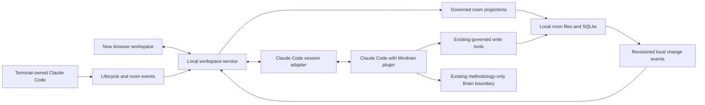

# MindrianOS localhost workspace: product and integration review

**Date:** 2026-09-20. **Disposition:** ready for design review; implementation is not approved or complete.

## Recommendation

Build a local MindrianOS workspace where a person can understand the problem they are working on, inspect the evidence, direct Larry, review decisions, and leave with a usable deliverable. Claude Code is the execution engine; the browser makes its work understandable and governable. The terminal and browser share room identity, task identity, durable outcomes, and explicit ownership of execution.

Do not base the new experience on the layout, routes, chat panel, or data assumptions of `http://localhost:3131`. That server is an older visualization surface, not the specification for this product. Preserve proven domain services where their contracts fit. Build a new browser application and local service boundary; keep the old launch command separate during development.

This report covers the entire intended journey and verifies the available baseline with source inspection, isolated HTTP checks, and a real headless browser. It does **not** claim that a new connected UI has been implemented or that a paid Claude run has been exercised.

## What the user should be able to do

The central question on opening MindrianOS should be: **What am I trying to resolve, what do I know, and what needs my attention next?**

A graph is useful when explaining relationships. It is not the opening task. A list of rendering formats is useful at export time. It is not the navigation model. Larry's conversation belongs beside the evidence and work it changes, rather than in a floating second chat application.

Recommended primary navigation:

| Area | User's job | Main contents |
|---|---|---|
| Work | Continue a concrete objective | Current question, task progress, next action, Larry conversation, pending approval |
| Evidence | Understand why a conclusion is credible | Documents, excerpts, provenance, assumptions, contradictions, related room sections |
| Decisions | Review what is proposed or settled | Proposed/confirmed/superseded claims, rationale, human attribution, unresolved choices |
| Deliverables | Inspect and use the outcome | Drafts, changes, preview, export, references to supporting evidence |
| Rooms | Choose the right context | Room purpose, child rooms, recent work, session bindings |

Connection details, logs, model settings, and installation diagnostics belong in a secondary status/settings surface. They must remain visible when something fails but should not become the user's normal work.

A room header always shows the selected room and its purpose. A compact session indicator says disconnected, observing terminal, ready, working, waiting for you, interrupted, or failed. “Connected” must mean an acknowledged live connection, not a presence file on disk.

### Screen concept

```text
MindrianOS    Room: Example venture / Customer need     Claude Code: Working
Work | Evidence | Decisions | Deliverables                         Rooms

What would make this customer problem worth solving?
Task: Test the demand assumption                  2 decisions need review

Evidence and working artifact              Conversation and activity
Interview excerpt + source                 Your instruction
Draft assumption and contrary evidence     Larry's next move and reason
Changes since your last review             Tool progress / cancel

[Review proposed decision]                  [Ask or direct Larry ...]
```

This is a new task-centered composition. On a narrow screen, switch between work and conversation with clear tabs; keep the room and pending approval accessible. Use semantic controls, keyboard focus, readable contrast, and text labels for status. De Stijl color marks can preserve Mindrian identity without making color the only signal.

## End-to-end intended journey

1. **Launch.** A proposed `mindrian-os ui` command starts one local service and prints its URL. It identifies its own process/version and an available port. Startup does not generate or overwrite room artifacts. No existing UI is silently reused because it happens to occupy a port.
2. **Choose context.** Select a room and see its purpose and child-room path. Bind the session explicitly. If multiple sessions or rooms exist, identify each; never infer the write target from the machine-wide last-active room.
3. **Connect execution.** Observe an existing terminal session, or start a browser-owned Claude Code session. Clearly distinguish these capabilities. Show a disconnected state with a concrete recovery action if Claude is absent, authentication fails, or the plugin fails to load.
4. **Set the task.** Describe a question or desired deliverable. Show the scoped evidence selected for it. Load the Mindrian plugin, governed methodology and room context through existing contracts. Avoid a new UI-specific reasoning engine.
5. **Work visibly.** Show meaningful tool progress, evidence references and artifact changes. The terminal can file work and the browser can refresh it. The browser can submit a task only when its adapter supports execution and owns the session.
6. **Review.** Present one explicit decision or permission with its consequences. Distinguish permission to run a tool from confirmation of a truth claim. A model response, a completed tool call, and a human-confirmed claim are separate states.
7. **Persist.** Persist artifacts and typed claims through existing governed write paths. Record task ID, session ID, source references and outcome. Show “saved” only after persistence succeeds. An interrupted write must not appear completed.
8. **Deliver.** Inspect the actual result and its changes, follow its sources, then export using existing capabilities. A deliverable should be retrievable from the room after closing the browser.
9. **Return.** Reopen the workspace, recover the selected room and durable task state, and show what changed. A dead process remains interrupted until explicitly recovered; it must not appear actively working.

## What OmniRoute contributes to this design

OmniRoute documents a local gateway and dashboard used to configure and monitor CLI integrations. Its Claude Code integration connects the CLI to that gateway. The relevant lesson is that a browser control surface and terminal workflow can operate over one local service. This does not establish that OmniRoute attaches a second chat client to an arbitrary live terminal conversation. [OmniRoute source and README](https://github.com/diegosouzapw/OmniRoute)

MindrianOS needs shared work and governed decisions, not a new provider-routing product. Reuse the local-service interaction pattern; do not import provider pooling, quota routing, or dashboard-centric information architecture merely because the reference product has them. The user's particular OmniRoute installation was not inspected; this comparison uses the project's public documentation.

## Session integration: what is feasible and what needs proof

Claude Code documents programmatic execution, streaming structured output, session continuation, and SDK approval callbacks. These are foundations for a browser-owned session, not proof of safe simultaneous control of an arbitrary interactive terminal. The installed CLI is `2.1.275`; its help exposes streaming, resume, plugin-directory and permission options. No authenticated model request was made for this review. [Claude Code programmatic usage](https://code.claude.com/docs/en/headless)

Hooks provide lifecycle integration points for observing a Claude Code session. They are useful for session presence and tool/activity reporting; do not treat a hook as a general-purpose terminal input channel. [Claude Code hooks reference](https://code.claude.com/docs/en/hooks)

Recommended capability contract:

| Mode | Browser capability | Ownership and limitations |
|---|---|---|
| Observe terminal | Read durable room changes, activity, pending status | Terminal owns execution. No promise that browser messages enter its conversation |
| Browser-owned session | Submit task, stream output, answer supported permissions, interrupt | Local adapter owns process/session; terminal can inspect shared work |
| Explicit handoff | Continue a selected session after ownership transfer | Stop or release original owner, verify session/version compatibility, then resume |
| Simultaneous control | Not a launch promise | Requires a separately proven supported transport and concurrency semantics |

The unanswered preference about where chat lives is handled as a review proposal: support observation and a browser-owned conversation, with explicit handoff. Do not silently equate shared files with a shared conversation. Do not use `--continue` without an exact session selection, scrape terminal ANSI as the application protocol, edit transcript files, or enable permission bypass to make a demo work.

A short integration spike must prove plugin loading, room binding, streaming, approval denial, interruption and explicit session resume with a harmless fixture before selecting CLI streaming versus the Agent SDK. Authentication and commercial terms must be checked for that selected mode; no blanket promise of subscription reuse or free API usage is made here.

## Proposed architecture and reuse boundaries



The browser never holds provider credentials or Brain credentials. The local service owns connection state, validates room paths, manages browser authentication, and exposes versioned task/event APIs. The adapter owns the process and its structured protocol. Existing domain services own room meaning and writes.

Reuse candidates verified on disk:

- `lib/core/session-binding.cjs`: session-specific room binding. Preserve its semantics; evaluate its unbound behavior before using it as an authorization boundary.
- `lib/core/session-presence.cjs`: presence evidence, augmented with fresh liveness/ownership checks rather than treated as proof of a running process.
- `lib/core/navigation.cjs`: governed graph reads and writes. New UI endpoints should not duplicate raw SQL queries.
- `lib/mcp/tool-router.cjs` and existing `artifact_file`, `claim_write`, `room_bind`, `gate_render`/`gate_answer` surfaces: existing filing, binding and decision contracts. Implementation must trace their concrete handlers rather than infer that all are interchangeable.
- `lib/mcp/session-catchup.cjs`: useful catch-up behavior, subject to per-session concurrency review.
- Existing wiki, presentation and export capabilities: call adapters after verifying their contracts; do not embed an old dashboard to obtain them.

Replace as product infrastructure: the old template injection, floating API-key chat, raw graph endpoint, global launch-time room selection, unversioned filesystem events, and inference that any listening dashboard process is the right application.

Proposed local protocol objects are `Workspace`, `Session`, `Task`, `ArtifactRevision`, `Decision`, and `Event`. Every mutating request carries room/session identity, an expected revision and an idempotency key. Events carry sequence numbers and task IDs. Reconnection uses a cursor; when retention is exceeded, reload a snapshot. A per-session execution lease rejects conflicting owners. Room switching cannot retarget a running task.

Local access still needs authentication, allowed Host/Origin validation, CSRF protection, bounded payloads, path/symlink containment, safe rendering and secret redaction. Store session credentials server-side and avoid tokens in URLs or browser storage. Keep user room content out of the methodology Brain. The normal model execution path and the proprietary Brain path are different boundaries and must be tested separately.

## Verified baseline findings

Source: working checkout `/home/jsagi/dev/MindrianOS-Plugin`, HEAD `1158431838db0d55000c8a57bf965efb1b94b94b`, package `2.0.0-beta.48`. Fetched `origin/main` was `96cfc2e60addbc4a5e1c490b78a78d9d97114186`; checkout is 39 commits ahead. The audited server and presentation/chat templates have no diff against that origin. Unrelated edits in three Phase-353 files were left untouched.

| Finding | Classification | Evidence and consequence |
|---|---|---|
| Server can launch and expose fixture data | WORKING | On isolated port 3193, status and graph return 200; seeded claim is returned |
| Browser does not receive initial room projection | NEW FAILURE | API contains the fixture claim; browser `ROOM_DATA` is `{}`. Server serves raw template and replaces only room/theme |
| File event does not update visible room state in tested page | NEW FAILURE | New fixture file emits `artifact-changed`; browser performs no section/graph data request and remains `{}` |
| Browser chat is not a Claude Code adapter | PRODUCT GAP | Source directly calls Anthropic Messages with an API key and one user message; no process/session bridge in this route |
| Session binding is not established by dashboard launch | PRODUCT GAP | Server fixes its room at startup; current product requires explicit per-session ownership |
| Mobile layout overflows | NEW FAILURE | Chromium at 390 x 844 reports document width greater than viewport; screenshot retained |
| Foreign Host accepted on read endpoint | NEW FAILURE | Fixture GET with `Host: review.invalid` returns 200. This demonstrates missing read-route host rejection, not a demonstrated browser exploit |
| Unauthenticated chat probe refused | WORKING, bounded | Missing-Origin POST returns 403; no model call. This does not prove the entire authorization boundary |
| External browser assets are requested | VERIFIED DEPENDENCY | Fonts, marked and D3 requests captured and blocked in the offline audit; local-only rendering is not established |
| Existing automated tests are green | WORKING, bounded | Graph-feed suite 3/3; dashboard integration passes. Their assertions do not prove rendered data or a shared conversation |

The raw `ROOM_DATA` placeholder and missing data-fetch path are source-confirmed, independent of blocked CDN resources. Browser evidence specifically describes the offline-asset condition; it is not a claim about online chart-library behavior.

Detailed QA and reproduction: [QA appendix](../../.planning/debug/localhost-workspace-review.md). Machine evidence: [evidence.json](../../.planning/quick/260920-bhx-localhost-review/evidence.json). [Desktop screenshot](../../.planning/quick/260920-bhx-localhost-review/baseline-desktop.png), [mobile screenshot](../../.planning/quick/260920-bhx-localhost-review/baseline-mobile.png).

## Delivery sequence and acceptance gates

| Stage | Deliverable | Exit evidence |
|---|---|---|
| 1. Connection proof | Isolated Claude adapter and room binding spike | Real fixture run streams, loads plugin, denies an action, interrupts, persists, resumes exact session; no bypass permissions |
| 2. New workspace shell | New launch identity, room selector, Work/Evidence/Decisions/Deliverables | Browser sees real fixture content, never old UI; task/room isolation and empty/error states verified |
| 3. Governed work loop | Browser-owned tasks and terminal observation | Instruction through execution, review, persistence and export proven on a fixture; second owner refused |
| 4. Recovery and packaging | Reconnect, interrupted-task recovery, install/update/stop | Restart preserves outcomes; stale approval rejected; scoped stop; package contains all assets and local service |
| 5. Platform acceptance | WSL/Windows browser plus supported native hosts | Manual and automated evidence for each supported surface; unsupported combinations named |

Release acceptance must cover:

1. Fresh install, no room, absent Claude, failed authentication, missing plugin, occupied port, and shutdown without killing unrelated processes.
2. Room A / Room B concurrent sessions, child-room identity, stale tabs, lease expiry, and room-switch attempts mid-task. No cross-room writes.
3. Real browser input to Claude, streamed tool activity, permission approve/deny, cancellation, subprocess exit, exact resume and duplicate-submit handling.
4. Artifact filing through governed paths, source links, human claim confirmation, supersession attribution, error rollback and reload after persistence.
5. File and SQLite changes, burst coalescing, reconnect replay, event gaps and DB failure. “Empty” and “unavailable” are distinct.
6. Script injection in imported content, forbidden Host/Origin, missing authentication, path traversal/symlinks, oversized input and log redaction.
7. Responsive keyboard-accessible UI at desktop and mobile widths, offline local assets, long documents and large-room pagination.
8. CLI, Desktop and Cowork parity at the domain layer. Browser process control may be CLI/local-host specific; Desktop/Cowork must report unsupported execution honestly rather than simulate it.
9. Brain-boundary capture showing no user content sent to the methodology service; model-provider traffic reviewed separately.
10. Packaging and release gates from the repository, including born-wired, projection, render, doctor and release ceremony when implementation ships.

Suggested performance targets, not measurements: useful local room view within 2 seconds on the agreed reference machine; committed artifact visible within 1 second; cancellation visibly acknowledged within 1 second. Measure fixture sizes and hardware before adopting these as release thresholds.

## Review decisions

Recommended decisions to accept or amend:

- Approve the task-centered workspace direction and a separate new UI entry point.
- Approve browser-owned execution plus observation of terminal work, with explicit handoff rather than an unproven simultaneous-chat promise.
- Make Claude adapter proof the first implementation gate; do not start by reskinning the old dashboard.
- Keep room state and domain governance authoritative; reuse tested services behind new adapters.

The requested review is complete as a report and evidence package. The proposed application remains to be built. Live model execution, approval callbacks, session handoff, Windows-browser access and native macOS/Windows behavior are implementation acceptance items, not passed checks in this review.
